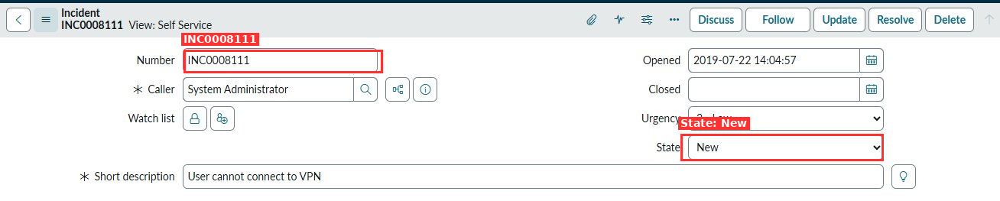
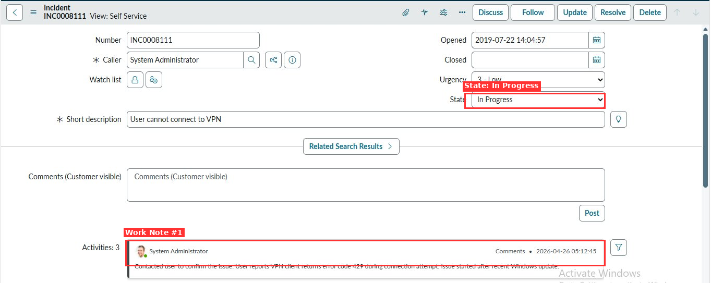
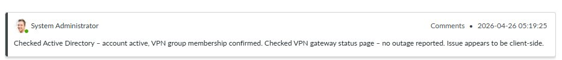
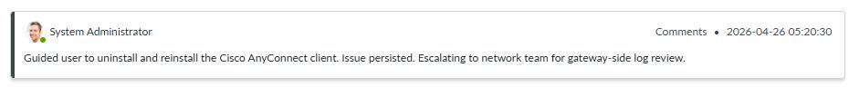
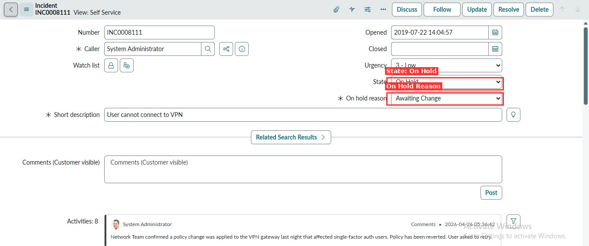
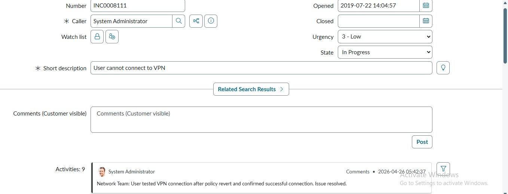
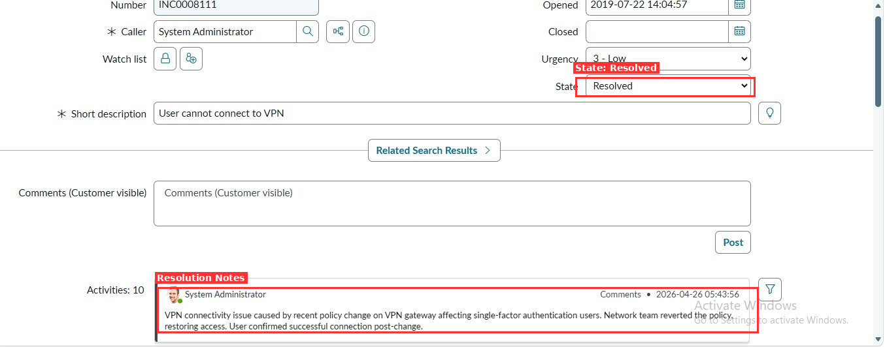
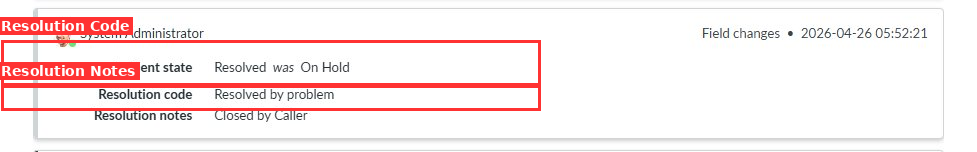
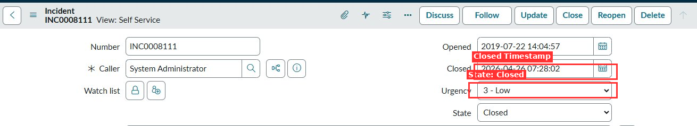

# Lab 2 - Work an Incident Through Its Full Lifecycle

> **Platform:** ServiceNow Personal Developer Instance (PDI)
> **Module:** Incident Management
> **Priority:** Critical
> **Estimated Time:** 30-45 minutes

---

## Objective

Take an existing incident from **New** through **Investigation**, **Pending**, **Resolved**, and **Closed**, writing structured work notes at every state transition to simulate a real-world IT support workflow.

By the end of this lab, you will be able to:

- Navigate the full incident lifecycle in ServiceNow
- Write structured, professional work notes at each stage
- Escalate an incident to another team with proper documentation
- Fill in Resolution Code and Resolution Notes correctly
- Close an incident and verify the Activity log tells a complete chronological story

---

## Business Scenario

A user has reported that their laptop cannot connect to the company VPN. The ticket has been logged and assigned to you. Your job is to investigate, document every action in the ticket, resolve the issue, get user confirmation, and close the record cleanly within the SLA window.

| Field | Value |
|---|---|
| Incident Number | INC0008111 |
| Caller | System Administrator |
| Short Description | User cannot connect to VPN |
| Urgency | 3 - Low |
| Opened | 2019-07-22 14:04:57 |

---

## Tools You Need

| Item | Detail |
|---|---|
| Platform | ServiceNow PDI - Incident module |
| Key Features | Work Notes, Activity Log, State field, Resolution Notes |
| SLA | Observe the SLA timer in the incident form if visible in your PDI |

---

## Step-by-Step Instructions

### Step 1 - Open the Incident

Open the incident created in Lab 1 (or create a new one using the VPN connectivity scenario above). Confirm it is in **New** state before proceeding.



> **What to verify:** The State field reads `New`. The Short Description reads `User cannot connect to VPN`. No work notes exist yet.

---

### Step 2 - Change State to In Progress and Add Work Note #1

1. Change the **State** field from `New` to `In Progress`
2. Scroll down to the **Work Notes** tab
3. Add the following work note:

```
Contacted user to confirm the issue. User reports VPN client returns error
code 429 during connection attempt. Issue started after recent Windows update.
```

4. Click **Save** or **Update**



> **What to verify:** State shows `In Progress`. The Activity log shows the first comment timestamped and attributed to your user.

---

### Step 3 - Add Work Note #2 (AD and Gateway Check)

After performing your initial diagnostics, add a second work note documenting your findings:

```
Checked Active Directory - account active, VPN group membership confirmed.
Checked VPN gateway status page - no outage reported. Issue appears to be client-side.
```

Click **Save** or **Update**.



> **What to verify:** A second entry appears in the Activity log at a later timestamp. The note clearly states what was checked and the outcome.

---

### Step 4 - Add Work Note #3 (Reinstall Attempt + Escalation Decision)

Attempt a standard client-side fix and document the result:

```
Guided user to uninstall and reinstall the Cisco AnyConnect client.
Issue persisted. Escalating to network team for gateway-side log review.
```

Click **Save** or **Update**.



> **What to verify:** Three work notes now appear in the Activity log. Each note stands alone and tells its piece of the story clearly.

---

### Step 5 - Escalate to Network Team and Set State to On Hold

1. Change the **Assignment Group** to `Network Team`
2. Change the **State** to `On Hold`
3. Set **On Hold Reason** to `Awaiting Change`
4. Add a work note summarizing all first-line steps completed and the reason for escalation

```
Escalating to Network Team. First-line actions completed:
- Verified AD account and VPN group membership (both active/confirmed)
- Confirmed no gateway outage via status page
- Guided user through Cisco AnyConnect uninstall/reinstall (issue persisted)
Root cause appears to be gateway-side. Network team required for log review.
```

Click **Save** or **Update**.



> **What to verify:** State reads `On Hold`. On Hold Reason reads `Awaiting Change`. Assignment Group updated to Network Team.

---

### Step 6 - Simulate Network Team Response (Work Note #5)

Add a work note simulating the network team's findings:

```
Network Team confirmed a policy change was applied to the VPN gateway last
night that affected single-factor auth users. Policy has been reverted.
User asked to retry.
```

Click **Save** or **Update**.

> **What to verify:** The Activity log now shows 8 entries. The most recent note documents the network team's root cause finding.

---

### Step 7 - Return to In Progress and Confirm Resolution

1. Change **State** back to `In Progress`
2. Add the following work note confirming the user's test result:

```
Network Team: User tested VPN connection after policy revert and confirmed
successful connection. Issue resolved.
```

Click **Save** or **Update**.



> **What to verify:** State is back to `In Progress`. Activity count shows 9 entries. Work note clearly documents user confirmation.

---

### Step 8 - Resolve the Incident with Resolution Notes

1. Change **State** to `Resolved`
2. Fill in the **Resolution Code** field - select `Resolved by Problem` (or `Solved by Change` if available in your PDI)
3. Fill in the **Resolution Notes** field with a clear root cause summary:

```
VPN connectivity issue caused by recent policy change on VPN gateway
affecting single-factor authentication users. Network team reverted the
policy, restoring access. User confirmed successful connection post-change.
```

4. Click **Save** or **Update**



> **What to verify:** State reads `Resolved`. Activity log shows 10 entries. Resolution notes clearly describe root cause, fix, and confirmation.

---

### Step 9 - Review the Field Changes (Audit Trail)

Scroll through the Activity log to locate the **Field Changes** entry. This system-generated entry records:

- Incident state transition: `Resolved was On Hold`
- Resolution code: `Resolved by problem`
- Resolution notes: `Closed by Caller`



> **What to verify:** The Field Changes block confirms the resolution code and notes were captured correctly by the system. This is the audit trail.

---

### Step 10 - Close the Incident

Wait 60 seconds (or simulate user confirmation acceptance), then:

1. Click the **Close** button at the top of the incident form
2. Confirm the **State** changes to `Closed`
3. Verify the **Closed** timestamp is now populated



> **What to verify:** State reads `Closed`. The Closed date/time field is populated (`2026-04-26 07:28:02`). The action buttons at the top now show `Reopen` instead of `Resolve`.

---

## Validation Checklist

Use this checklist to confirm you have completed the lab successfully:

- [ ] Incident INC0008111 is in **Closed** state
- [ ] **Closed** timestamp is populated on the incident form
- [ ] Activity log contains **at least 10 entries** including all state transitions
- [ ] Work Note 1 documents the error code (429) and trigger (Windows update)
- [ ] Work Note 2 documents AD check and gateway status check
- [ ] Work Note 3 documents the reinstall attempt and escalation decision
- [ ] Incident was escalated to **Network Team** with State set to **On Hold**
- [ ] Network team root cause (VPN gateway policy change) is documented
- [ ] User confirmation of successful VPN connection is documented
- [ ] **Resolution Code** and **Resolution Notes** are filled in
- [ ] A colleague can read the Activity log from top to bottom and understand the full story without asking any questions

---

## Incident Timeline Summary

| Time | Action | State |
|---|---|---|
| 2026-04-26 05:12:45 | Work Note #1 - User contacted, error 429 confirmed | In Progress |
| 2026-04-26 05:19:25 | Work Note #2 - AD check and gateway status verified | In Progress |
| 2026-04-26 05:20:30 | Work Note #3 - AnyConnect reinstall failed, escalation decided | In Progress |
| 2026-04-26 05:22:38 | Work Note #4 - Escalation note + all first-line steps documented | In Progress |
| 2026-04-26 05:36:42 | Work Note #5 - Network team root cause (policy change, reverted) | On Hold |
| 2026-04-26 05:42:37 | Work Note #6 - User confirmed VPN working after policy revert | In Progress |
| 2026-04-26 05:43:56 | Resolution Notes added, state set to Resolved | Resolved |
| 2026-04-26 05:52:21 | Field changes audit entry recorded by system | Resolved |
| 2026-04-26 07:28:02 | Incident closed | Closed |

---

## Key Concepts Reinforced

**Work Notes vs. Comments**
Work notes are internal only (not visible to the caller). Comments are customer-visible. Always use work notes for internal investigation steps and use comments only when communicating updates to the end user.

**State Transitions**
Every state change in ServiceNow is recorded in the Activity log automatically. You should always pair a state change with a work note explaining *why* the state changed.

**On Hold - Awaiting Change**
Setting the On Hold reason to `Awaiting Change` is the correct practice when an incident cannot progress until a separate change activity (like a config revert) is completed by another team.

**Resolution Code**
Always select the most accurate resolution code. `Resolved by Problem` links this incident to a known problem record. `Solved by Change` would be used if a formal Change Request drove the fix.

**Closed vs. Resolved**
Resolved means the fix has been applied and confirmed. Closed means the user has accepted the resolution (or the auto-close timer has elapsed). Never manually skip Resolved and jump to Closed.

---

## Related Labs

- **Lab 1** - Create and Categorize an Incident
- **Lab 3** - Create a Change Request Linked to an Incident
- **Lab 4** - Build a Knowledge Article from a Resolved Incident

---

## Notes

> Screenshots in this lab were captured on a ServiceNow PDI running the current release. Field layouts may vary slightly between PDI versions. The Activity log entry count and timestamps are specific to this lab walkthrough session (2026-04-26).
