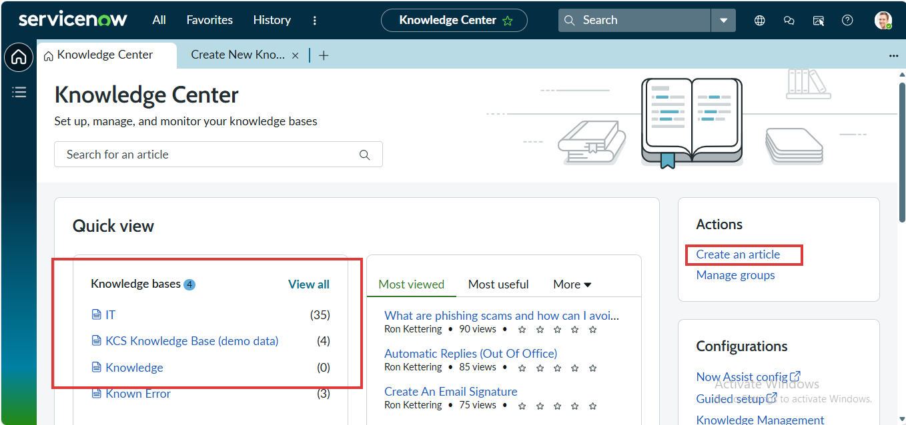
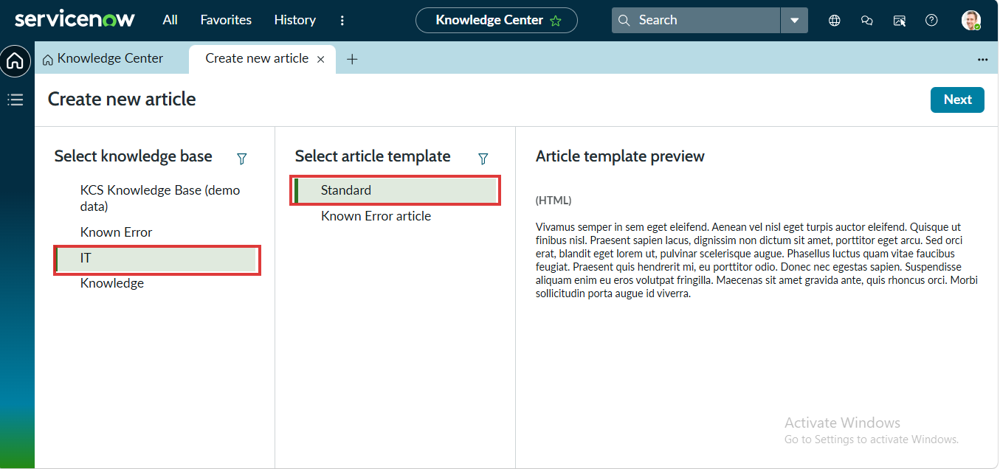
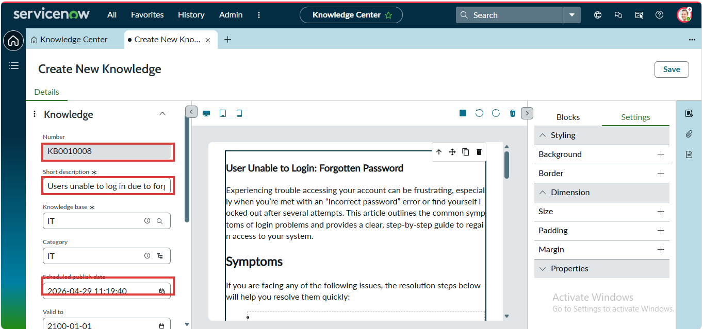
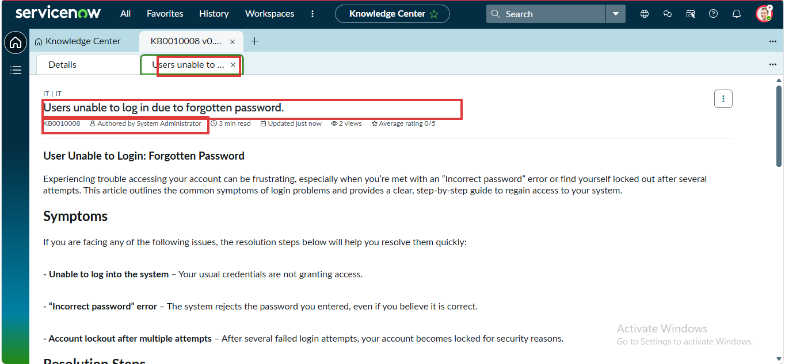
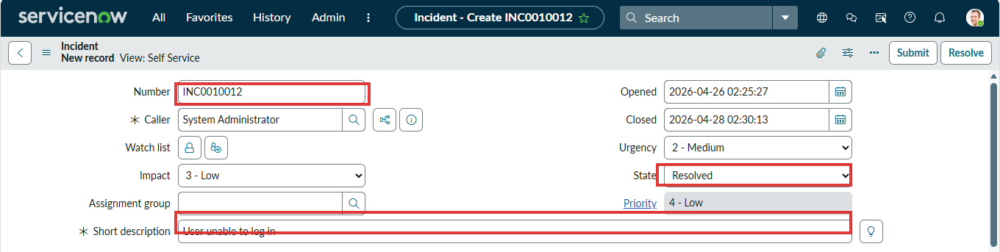
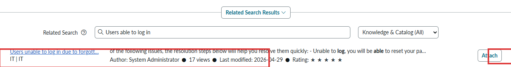
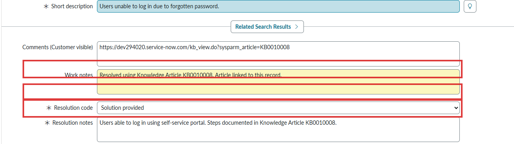
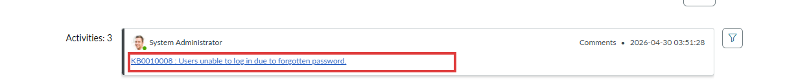
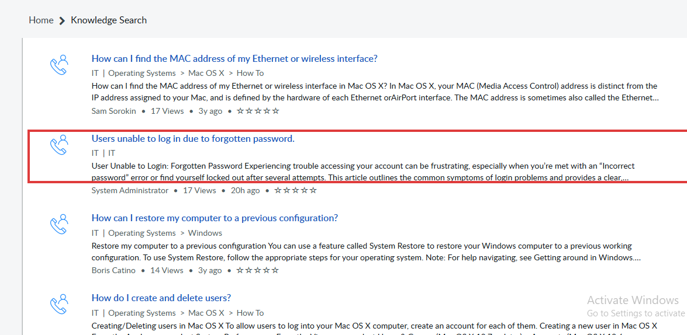
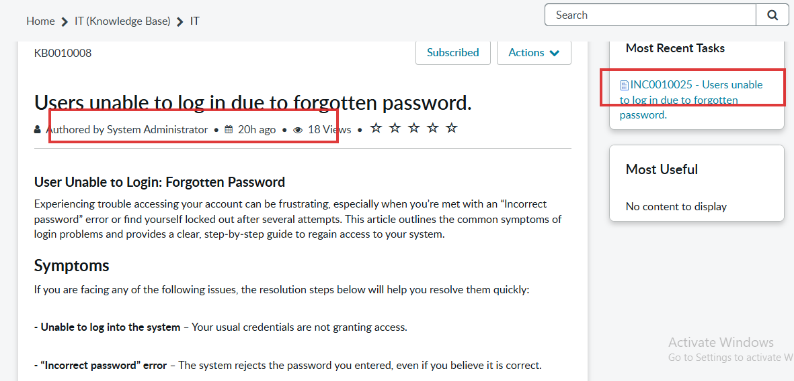

# Lab 04 - Use the Knowledge Base to Document and Reuse Solutions

**Platform:** ServiceNow Personal Developer Instance (PDI)
**Module:** Knowledge Management
**Priority:** High
**Estimated Duration:** 45-60 minutes

---

## Objective

Create a knowledge article in ServiceNow, link it to a resolved incident, and demonstrate how a well-maintained knowledge base reduces ticket volume and average handle time (AHT).

---

## Business Scenario

> You have resolved the same password reset question three times this week. Your team lead asks you to write a knowledge article so users can self-serve, and so colleagues can resolve the same issue faster without having to investigate from scratch every time.
>
> The goal is to capture institutional knowledge, make it searchable, and link it back to the incident as evidence of structured problem resolution.

---

## Key Concepts Before You Begin

| Term | Definition |
|---|---|
| **Knowledge Base (KB)** | A categorised repository of articles agents and users can search for solutions |
| **Knowledge Article** | A single document within a KB - can be a How To, FAQ, or Known Error |
| **KB Number** | Unique identifier for each article, prefixed `KB` (e.g. KB0010008) |
| **Workflow State** | The publishing lifecycle: Draft > Review > Published |
| **KCS** | Knowledge-Centred Service - the practice of capturing knowledge as part of solving problems, not after |
| **Article Linking** | Attaching a KB article directly to an incident to trace what resolved it |
| **View Count** | Tracks how many times an article has been opened - used to measure article value |

---

## Tools Required

| Resource | Details |
|---|---|
| Platform | ServiceNow PDI |
| Navigation | Knowledge > Articles > Create New |
| Navigation | Self Service > Knowledge Base |
| Navigation | Service Desk > Incidents |
| Records used | KB Article, INC record |
| Modules | Knowledge Management, Incident Management |

---

## Lab Steps

### Step 1 - Explore the Knowledge Center Dashboard

Navigate to **Knowledge > Knowledge Center** (or search "Knowledge Center" in the application navigator).

Observe the dashboard layout:
- **Knowledge bases** panel - lists all available KBs and their article counts. In this instance: IT (35 articles), KCS Knowledge Base (4), Knowledge (0), Known Error (3)
- **Most viewed / Most useful** tabs - surface high-value articles for quick access
- **Actions panel** (right) - quick links to Create an article and Manage groups
- **Configurations** panel - access to Now Assist config, Guided setup, and Knowledge Management settings

> The Knowledge Center is the management hub for all knowledge bases. Before creating an article, always check whether a similar one already exists to avoid duplication.


*Fig 1 - Knowledge Center homepage. Highlighted: the "Create an article" action link (top right) and the Knowledge bases list showing article counts per base. The IT knowledge base with 35 articles is where this lab's article will be created.*

---

### Step 2 - Select Knowledge Base and Article Template

Click **Create an article** from the Actions panel, or navigate to **Knowledge > Articles > Create New**.

The article creation wizard presents three panels:

**Panel 1 - Select knowledge base:**
- KCS Knowledge Base (demo data)
- Known Error
- **IT** - select this one (highlighted with green bar)
- Knowledge

**Panel 2 - Select article template:**
- **Standard** - a general-purpose HTML template (select this)
- Known Error article - structured for known error records

**Panel 3 - Article template preview:**
Shows a live preview of the template structure before you commit to it.

Click **Next** to proceed to the article editor.

> Always match the template to the content type. Use Standard for How-To and FAQ articles. Use Known Error article only when the article is being linked to a Problem record.


*Fig 2 - Article creation wizard. Highlighted: "IT" selected as the knowledge base (left panel, green bar) and "Standard" as the template (centre panel). The preview on the right shows the template structure before committing.*

---

### Step 3 - Write and Configure the Knowledge Article

After clicking Next, the full article editor opens. Complete the following fields:

**Left metadata panel:**

| Field | Value Used |
|---|---|
| Number | KB0010008 (auto-generated) |
| Short description | Users unable to log in due to forgotten password |
| Knowledge base | IT |
| Category | IT |
| Scheduled publish date | 2026-04-29 11:19:40 |
| Valid to | 2100-01-01 |

**Article body (centre canvas):**

Write the article using the rich text editor. Structure the content as:

```
Title: User Unable to Login: Forgotten Password

Introduction paragraph explaining the issue and the article's purpose.

## Symptoms
- Unable to log into the system - your usual credentials are not granting access
- "Incorrect password" error - the system rejects the password even when you believe it is correct
- Account lockout after multiple attempts - your account becomes locked for security reasons

## Resolution Steps
Step-by-step instructions for resetting via the self-service portal...
```

**Right panel (Blocks / Settings):**
Use the Settings panel to adjust Styling, Background, Border, Dimension (Size, Padding, Margin), and Properties for the content blocks.

> Set the Scheduled publish date to today or a near future date. Set Valid to a far future date (2100-01-01) so the article does not expire unexpectedly.


*Fig 3 - The Create New Knowledge editor. Highlighted: the auto-generated KB number (KB0010008), the Short description field, and the Scheduled publish date. The centre canvas shows the article body with Symptoms section visible.*

---

### Step 4 - Publish the Knowledge Article

After completing the article content:

1. Click **Save** to save in Draft state
2. Open the **Details** tab and locate the **Workflow State** field
3. Change Workflow State from `Draft` to `Published`
4. Click **Update** or **Publish** (button label varies by PDI configuration)

The published article view confirms:

- **Article title:** Users unable to log in due to forgotten password
- **KB Number:** KB0010008
- **Knowledge base path:** IT | IT
- **Author:** System Administrator
- **Read time:** 3 min read
- **Views:** 2 views (incrementing with each open)
- **Average rating:** 0/5 (no ratings yet)

The article tab in the header (shown as "Users unable to...") confirms the article is now in the published, readable state.

> Some PDI configurations route articles through an approval workflow before they reach Published state. If your article moves to "Awaiting Approval" after saving, ask your KB manager to approve it, or check the Knowledge Management > Administration settings to adjust the workflow.


*Fig 4 - Published state of KB0010008. Highlighted: the KB number and metadata line (KB0010008, authored by System Administrator, 2 views) and the article title. The green-outlined tab confirms the article is open and published.*

---

### Step 5 - Open the Related Incident

Navigate to **Service Desk > Incidents** and open **INC0010012**, or create a new incident with these details if it does not exist:

| Field | Value |
|---|---|
| Number | INC0010012 |
| Caller | System Administrator |
| Opened | 2026-04-26 02:25:27 |
| Impact | 3 - Low |
| Urgency | 2 - Medium |
| Priority | 4 - Low |
| State | Resolved |
| Short description | User unable to log in |

This incident represents the password reset issue that prompted the knowledge article. The State is already `Resolved` - you will now link the KB article to this record as evidence of the resolution method used.

> If creating a new incident, set the Short description to "User unable to log in" and set State to Resolved before proceeding. This simulates a realistic post-resolution documentation workflow.


*Fig 5 - Incident INC0010012 with Short description "User unable to log in". Highlighted: the INC number, the State showing "Resolved", and the Short description field - the three fields that establish the context for linking the KB article.*

---

### Step 6 - Search for the KB Article from the Incident

Within the incident record, scroll down to the **Related Search Results** section (this appears automatically below the Short description field, powered by ServiceNow's contextual search).

Alternatively, use the **Knowledge** field or click the lightbulb icon next to the Short description to trigger a knowledge search.

In the Related Search box, type: `Users able to log in`

The search returns:

- **Article:** Users unable to log in due to forgott...
- **Knowledge base:** IT | IT
- **Author:** System Administrator
- **Views:** 17 views
- **Last modified:** 2026-04-29
- **Rating:** 4 out of 5 stars

Click **Attach** on the right of the result to link the article to this incident.

> The Related Search feature uses contextual matching based on the incident short description. This is a core KCS practice - surfacing relevant knowledge automatically during the resolution process, before an agent even thinks to search manually.


*Fig 6 - Related Search Results panel within the incident. Highlighted: the article result "Users unable to log in due to forgott..." with its IT | IT classification, and the "Attach" button on the right. Attaching creates the formal link between the incident and the KB article.*

---

### Step 7 - Add Work Notes and Resolution Details

After attaching the article, complete the incident resolution documentation:

**Comments (Customer visible):**
```
https://dev294020.service-now.com/kb_view.do?sysparm_article=KB0010008
```
Paste the direct URL to the article so the user can access the self-service steps themselves.

**Work Notes (Internal - not visible to caller):**
```
Resolved using Knowledge Article KB0010008. Article linked to this record.
```

**Resolution code:** Solution provided

**Resolution notes:**
```
Users able to log in using self-service portal. Steps documented in Knowledge Article KB0010008.
```

Click **Update** to save all changes.

> Always include the KB article number in both the Work Notes and the Resolution Notes. This creates a bidirectional audit trail - you can find the incident from the article, and find the article from the incident.


*Fig 7 - Incident resolution section fully completed. Highlighted: the Work Notes field ("Resolved using Knowledge Article KB0010008. Article linked to this record."), the Resolution code ("Solution provided"), and the Resolution notes referencing KB0010008.*

---

### Step 8 - Confirm the Article Appears in the Activity Log

Scroll down to the **Activities** section of the incident (the audit trail / journal).

You should see an activity entry:

```
System Administrator                           Comments - 2026-04-30 03:51:28
KB0010008 : Users unable to log in due to forgotten password.
```

This hyperlinked entry confirms the KB article is formally attached to the incident record and traceable from the activity log.

> The activity log is permanent and tamper-evident. Once a KB article is linked and the record is saved, this entry cannot be removed without administrative access. This is your audit evidence that KCS practice was followed.


*Fig 8 - The Activities section of the incident. Highlighted: the KB0010008 hyperlink entry timestamped 2026-04-30 03:51:28. This confirms the article is formally attached and discoverable from the incident record.*

---

### Step 9 - Validate Article Discoverability via Self-Service Portal

Navigate to **Self Service > Knowledge Base** (or go to the Service Portal and search from there).

In the Knowledge Search bar, type: `password reset` or `unable to log in`

Confirm your article appears in the search results:

| Result | Details |
|---|---|
| Title | Users unable to log in due to forgotten password |
| Knowledge base | IT | IT |
| Author | System Administrator |
| Views | 17 views |
| Last modified | 20h ago |
| Rating | Not yet rated |

The article sits between other IT articles (MAC address lookup, system restore guide, user management) - confirming it is indexed and discoverable alongside established content.

> If your article does not appear in search results immediately, wait 1-2 minutes and search again. ServiceNow indexes new articles shortly after publishing. If it still does not appear, verify the Workflow State is set to Published (not Draft) and the Knowledge base is set to IT (not a restricted base).


*Fig 9 - Knowledge Search results page. Highlighted: the "Users unable to log in due to forgotten password" article in the results list, showing IT | IT classification, System Administrator authorship, and 17 views - confirming it is publicly indexed and discoverable.*

---

### Step 10 - Review the Article and Confirm View Count

Open the published article from the search results or from the KB directly (KB0010008).

Confirm the following on the article page:

- **Title:** Users unable to log in due to forgotten password
- **KB Number:** KB0010008
- **Author:** System Administrator
- **Published:** 20h ago
- **View count:** 18 Views (incremented from 17 after the search in Step 9)
- **Most Recent Tasks sidebar:** Shows INC0010025 - Users unable to log in due to forgotten password - confirming the incident-to-article relationship is visible from the article side as well

The bidirectional link is now complete:
- From the **incident**, you can see the KB article in the activity log
- From the **KB article**, you can see the linked incident in the Most Recent Tasks sidebar

> The view count incrementing from 17 to 18 after your search validates that the article is being tracked. Over time, a high view count with low new-incident volume on the same topic is the primary metric that proves the article is achieving deflection.


*Fig 10 - The published KB0010008 article viewed from the self-service portal. Highlighted: the article metadata line showing "18 Views" and the "Most Recent Tasks" sidebar linking back to INC0010025. This bidirectional traceability is the hallmark of a well-implemented KCS workflow.*

---

## Validation Checklist

| Validation Check | Expected Result | Status |
|---|---|---|
| KB article created | KB0010008 exists in Knowledge > Articles | - |
| Knowledge base correct | Article belongs to IT knowledge base | - |
| Workflow state | Article is Published (not Draft) | - |
| Article structure | Contains title, symptoms, and resolution steps | - |
| Incident exists | INC0010012 with "User unable to log in" | - |
| Incident state | Resolved | - |
| KB article attached | Article appears in incident activity log | - |
| Work notes completed | "Resolved using Knowledge Article KB0010008..." | - |
| Resolution code set | "Solution provided" | - |
| Customer URL shared | KB article URL in Comments (Customer visible) | - |
| Portal discoverability | Article appears in Self Service KB search | - |
| View count > 0 | Article shows at least 1 view | - |
| Bidirectional link | Incident visible in article's Most Recent Tasks | - |

---

## Knowledge Article Lifecycle

```
Idea / Trigger
    |
    v
Draft
    |  (author writes content)
    v
Review / Awaiting Approval     <-- some PDI configs skip this
    |  (KB manager reviews)
    v
Published                      <-- article is searchable and linkable
    |
    v
Retired / Outdated             <-- set Valid to date in the past
    |
    v
Archived or Deleted
```

---

## Key Principles: KCS (Knowledge-Centred Service)

The KCS methodology underpins how ServiceNow's Knowledge module should be used:

**Capture** - Document the solution as part of solving the problem, not after. Never leave an incident without linking or creating a KB article if the issue is likely to recur.

**Structure** - Use consistent templates. Every article should have a Summary, Symptoms section, and Resolution Steps. Inconsistent structure makes articles harder to find and use.

**Reuse** - Search before you solve. Always check the KB before investigating. If an article exists, use it and increment the view count. If it does not, create one.

**Improve** - Articles are living documents. If a resolution step changes, update the article. Use the rating system and feedback to flag articles that need revision.

---

## Concepts Summary

**Knowledge Base vs Knowledge Article**
The Knowledge Base is the container (e.g. IT). The Knowledge Article is the individual document (e.g. KB0010008). One KB can contain hundreds of articles. Articles are categorised within the KB for organised browsing.

**Draft vs Published**
A Draft article exists but is not searchable by end users. A Published article is indexed and appears in portal search results. Always confirm the workflow state before telling a user an article exists.

**Linking vs Attaching**
Linking a KB article to an incident creates a relationship record - the article appears in the Related Knowledge list. Attaching via the Attach button in Related Search Results achieves the same outcome through a different UI path. Both result in the same activity log entry.

**View Count as a Metric**
Each time an article is opened, its view count increments. High view counts on specific articles tell knowledge managers which topics generate the most self-service activity. This data drives decisions about what new articles to create and which to retire.

**Ticket Deflection**
The primary business value of a well-maintained KB is deflection - users who find the answer themselves never raise a ticket. This reduces inbound volume, lowers average handle time, and frees agents for complex work.

---

## Files in This Lab

```
lab-04-knowledge-base/
- README.md                                          <- This file - full lab walkthrough
- TICKET_NOTES.md                                    <- Agent documentation and article content
- QUICK_REFERENCE.md                                 <- KB cheat sheet and lifecycle reference
- images/
  - 01_knowledge_center_dashboard.png                <- Knowledge Center homepage
  - 02_select_knowledge_base_and_template.png        <- Article creation wizard
  - 03_create_new_knowledge_article.png              <- Article editor with content
  - 04_published_article_kb0010008.png               <- Published article view
  - 05_incident_inc0010012_opened.png                <- Related incident record
  - 06_related_search_results.png                    <- Contextual KB search from incident
  - 07_work_notes_and_resolution_linked.png          <- Completed resolution fields
  - 08_activity_log_kb_article_attached.png          <- Activity log showing KB link
  - 09_article_in_knowledge_search_results.png       <- Article in portal search results
  - 10_article_published_view_with_incident_link.png <- Article with view count and INC link
```

---

## Related Labs

- Lab 01 - Log and Resolve an Incident
- Lab 02 - Incident Assignment and Escalation
- Lab 03 - Log and Fulfil a Service Request
- **Lab 04 - Use the Knowledge Base to Document and Reuse Solutions** (this lab)
- Lab 05 - Change Management and CAB Approval
