# Raise and Manage a Change Request in ServiceNow

> **Author:** Nnamso Mkpong
>
> **Domain:** ServiceNow - Change Management, ITIL Change Process, Personal Developer Instance
>
> **Environment:** ServiceNow Personal Developer Instance (PDI) - developer.servicenow.com
>
> **Completed:** May 2026

---

## Objective

Create a Normal Change Request in ServiceNow, complete all required planning fields - including risk assessment, implementation plan, backout plan, and test plan - then route the record through the full ITIL change lifecycle: New, Assess, Authorize, Scheduled, Implement, Review, and Closed. Demonstrate that the Change Management module, approval workflow, work note logging, and closure documentation all function end to end.

---

## Business Scenario

> **Network Maintenance Window - May 2026**
>
> The network team has identified that the core switch on the second floor is running outdated firmware. The current version has known vulnerabilities and is degrading switch performance under peak load. The team lead has asked you to raise a Normal Change Request in ServiceNow to document the planned firmware upgrade, route it through the Change Advisory Board for approval, and track the work through to successful closure.

This lab reflects how change management works in practice. Before any planned infrastructure work begins in a regulated or enterprise environment, a formal change record must exist. The change record is not bureaucracy - it is the mechanism that prevents uncoordinated work from causing outages, the documentation that proves work was authorised, and the audit trail that shows exactly what happened and when. A technician who starts work without an approved change record is working blind: there is no rollback plan, no approval chain, and no audit trail if something goes wrong.

Change management exists specifically to prevent incidents. Every field in the change form - the implementation plan, the backout plan, the test plan, the risk assessment - represents a decision made before work begins rather than a scramble after something breaks.

---

## Environment and Tools Used

| Component | Detail |
|---|---|
| **Platform** | ServiceNow Personal Developer Instance (PDI) |
| **Module** | Change Management |
| **Change type** | Normal |
| **CHG number** | CHG0030007 |
| **Short description** | Upgrade core network switch firmware for second floor |
| **Assignment group** | Network Team |
| **Requested by** | System Administrator |
| **Approver** | Howard Johnson |
| **Risk level** | Moderate |
| **Final state** | Closed - Successful |

---

## Understanding Change Types in ServiceNow

> **Change type determines the approval workflow, the number of required fields, and the risk tolerance of the process. Selecting the wrong change type is one of the most common mistakes on first-time change submissions.**

```
CHANGE TYPES

Emergency Change
  Definition:  Unplanned work required immediately to restore service
  Approval:    Expedited - Emergency CAB or single senior approver
  Use case:    Fixing an active outage, reverting a failed deployment
  Risk:        Highest - less review time means higher chance of error

Normal Change
  Definition:  Planned, non-routine work requiring full risk assessment
  Approval:    Standard CAB review cycle before work begins
  Use case:    Firmware upgrades, infrastructure changes, new deployments
  Risk:        Medium to high - but mitigated by the planning process

Standard Change (Pre-approved)
  Definition:  Low-risk, repeatable work with a pre-approved template
  Approval:    No CAB required - already approved at template level
  Use case:    Reboot Windows Server, replace printer toner, add a VLAN
  Risk:        Low - process is well-documented and frequently repeated

KEY RULE
  Normal Change is the default for planned work that has not been done
  before or does not yet have a pre-approved template.
  If in doubt, raise Normal and let the CAB downgrade it.
  Never raise Standard when the work is genuinely novel.
```

In this lab, the firmware upgrade for the second-floor core switch was raised as a Normal Change because it affects all users on that floor and involves risk of connectivity disruption during the maintenance window.

---

## Steps Performed

---

### Phase 1 - Navigate to Change Management and Select Change Type

**Step 1.1 - Open the Create Change Request Screen and Select Normal**

Navigate to **Change > Create New** in the ServiceNow top navigation bar. The system presents a template selection screen showing all available change types. Select **Normal** - the ITIL Mode 1 Normal Change template.

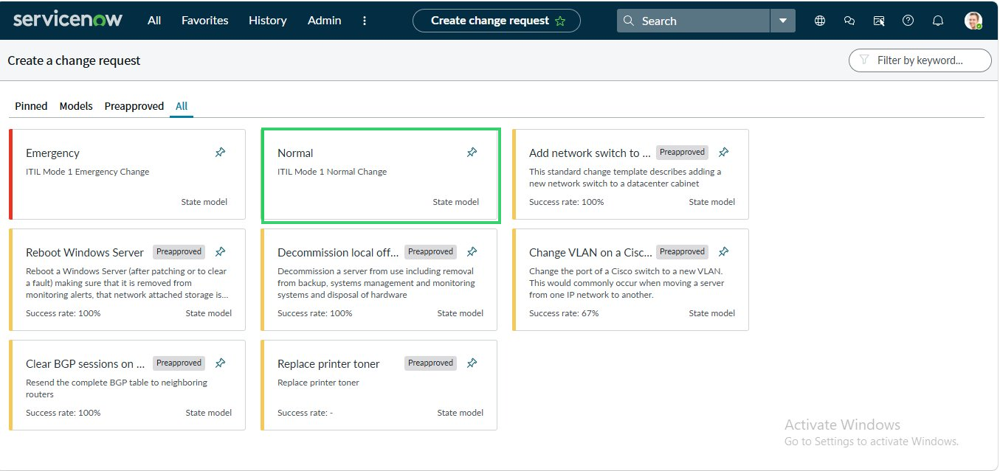

> **Green highlight:** The Normal change card is outlined in green, confirming selection. Normal changes follow the full ITIL workflow: New - Assess - Authorize - Scheduled - Implement - Review - Closed. This is the most complete change lifecycle in ServiceNow and the one used whenever planned work carries meaningful risk.
>
> The screen also shows Standard (pre-approved) templates - Reboot Windows Server, Decommission Local Office, Change VLAN on a Cisco switch, Clear BGP Sessions, and Replace Printer Toner. These are pre-approved because they are repeatable, low-risk, and already have tested runbooks. The firmware upgrade being raised in this lab does not yet have a pre-approved template, so Normal is the correct selection.

---

### Phase 2 - Complete the Change Request Header Fields

**Step 2.1 - Fill in the New Change Request Form**

A blank Change Request form opens with a system-assigned CHG number. Complete the following header fields:

- **Short description:** Upgrade core network switch firmware for second floor
- **Description:** Planned upgrade of core switch firmware to improve performance, patch vulnerabilities, and ensure stability
- **Category:** Other
- **Priority:** 4 - Low (priority of the change process itself, not the urgency of the underlying risk)
- **Assignment group:** Network Team
- **Planned start date:** 2026-05-09 02:23:31
- **Planned end date:** 2026-05-09 02:23:48
- **Model:** Normal
- **Type:** Normal
- **State:** New

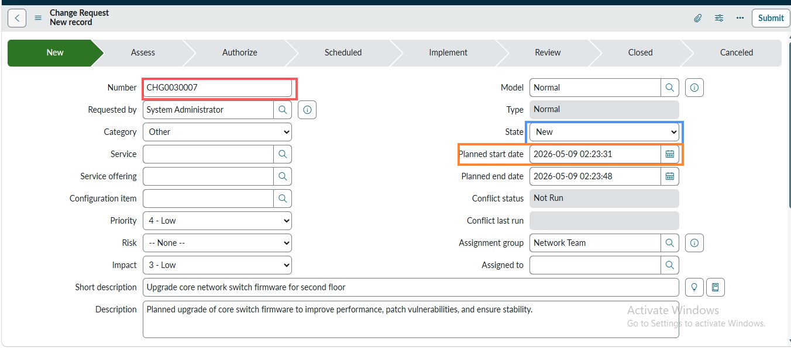

> **Red highlight:** CHG0030007 - the system-assigned Change number. This number is generated the moment the form opens and is reserved for this record. Every approval, work note, and audit entry will reference this number for the life of the record.
>
> **Blue highlight:** The State field showing New. This is the starting state for all Normal Changes. The workflow banner across the top - New, Assess, Authorize, Scheduled, Implement, Review, Closed, Canceled - shows the full lifecycle. Each state transition represents a formal gate in the ITIL process.
>
> **Orange highlight:** The Planned start date field. Entering a future date signals to the CAB and scheduling tools that this change is planned, not emergency. The date is used to check for conflicts with other scheduled changes in the Conflicts tab.

---

### Phase 3 - Set Risk Level and Complete the Description

**Step 3.1 - Update the Risk Field and Review the Description**

Scroll down the form to the Risk and Description fields. Set Risk to **Moderate** - this upgrade affects all users on the second floor and involves a brief network interruption during the maintenance window. Confirm the description explains the business justification for the change.

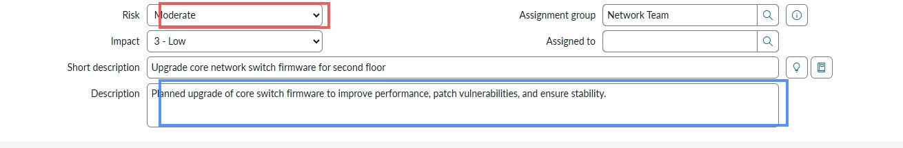

> **Red highlight:** The Risk field set to Moderate. Risk in ServiceNow Change Management is the technician's assessment of how likely the change is to cause disruption and how severe that disruption would be. Moderate means: disruption is possible, the blast radius is meaningful (second floor users), but the work is understood and has a rollback path. Low risk would be appropriate for a single-user change. High risk would be appropriate for changes that affect the entire organisation or involve no tested rollback.
>
> **Blue highlight:** The Description field reads: "Planned upgrade of core switch firmware to improve performance, patch vulnerabilities, and ensure stability." A good description answers three questions: what is being done, why it is being done, and what the expected outcome is. This description answers all three.

---

### Phase 4 - Complete the Implementation Plan

**Step 4.1 - Document the Step-by-Step Implementation Plan**

Scroll to the Planning tab and complete the **Implementation plan** field with each step of the planned work in sequence. The implementation plan must be detailed enough that anyone on the team could execute it without additional briefing.

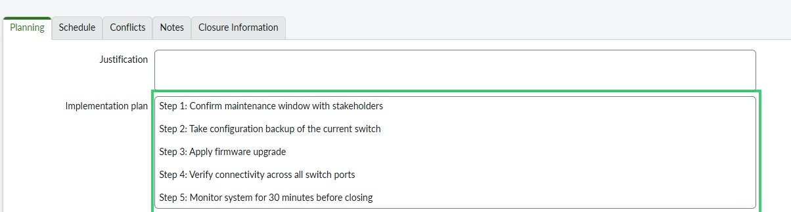

> **Green highlight:** The Implementation plan field showing all five steps:
>
> - Step 1 - Confirm maintenance window with stakeholders
> - Step 2 - Take configuration backup of the current switch
> - Step 3 - Apply firmware upgrade
> - Step 4 - Verify connectivity across all switch ports
> - Step 5 - Monitor system for 30 minutes before closing
>
> This is the sequence of actions the engineer will follow during the maintenance window. Step 2 - taking the configuration backup - is critical because it is the foundation of the backout plan. If Step 3 fails, Step 2 is what makes recovery possible. A well-written implementation plan makes the backout plan obvious.

---

### Phase 5 - Complete the Backout Plan

**Step 5.1 - Document the Rollback Procedure**

Complete the **Backout plan** field immediately below the Implementation plan. The backout plan must be specific, actionable, and time-bounded.

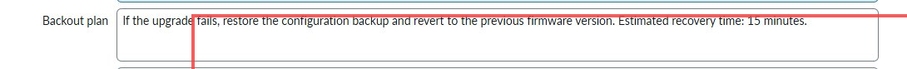

> **Red highlight:** The Backout plan reads: "If the upgrade fails, restore the configuration backup and revert to the previous firmware version. Estimated recovery time: 15 minutes."
>
> A backout plan that says "revert if needed" is not a backout plan - it is a vague intention. A real backout plan names the specific action (restore the configuration backup taken in Step 2), the specific outcome (previous firmware version running), and the estimated time to recover (15 minutes). The 15-minute estimate matters because it determines whether the maintenance window is long enough to include a failed attempt and a full recovery before business hours begin.

---

### Phase 6 - Complete the Test Plan

**Step 6.1 - Define the Acceptance Criteria for the Change**

Complete the **Test plan** field. The test plan defines the specific checks that confirm the change was successful before the maintenance window is closed.


> **Orange highlight:** The Test plan field containing four specific checks:
>
> - Ping all connected devices
> - Verify internet access
> - Confirm file server access
> - Check VoIP phone registration
>
> These four tests cover the four main services that depend on the switch: general IP connectivity (ping), external access (internet), internal file services (file server), and voice communications (VoIP). If all four pass, the firmware upgrade is confirmed successful. If any fail, the backout plan is invoked. The test plan turns a subjective question ("did it work?") into an objective checklist with clear pass/fail criteria.

---

### Phase 7 - Save the Record and Advance to Assess State

**Step 7.1 - Submit the Record and Confirm State Transitions to Assess**

Click **Submit** to save the Change Request. The system saves the record and automatically advances the State from New to **Assess**. The Assess state is where the Change Advisory Board reviews the planning documentation before authorising the work.

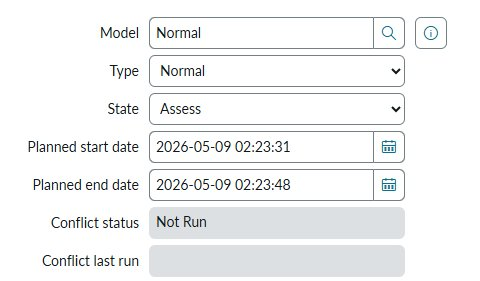

> **Red highlight:** The State field showing **Assess**. The Assess state is the first formal review gate in the Normal Change lifecycle. At this stage, the CAB will review the implementation plan, backout plan, test plan, and risk assessment to confirm that the change is adequately planned before it moves to authorisation.
>
> The record transition from New to Assess confirms that all mandatory fields were filled correctly - ServiceNow validates required fields on submission and will not advance the state if anything critical is missing.

---

### Phase 8 - Confirm the CHG Record in the List View

**Step 8.1 - Locate CHG0030007 in the Change List and Verify the Authorize State**

Navigate to Change > All to open the full change list. Locate CHG0030007 and confirm the record details are correct before proceeding to the approval step.

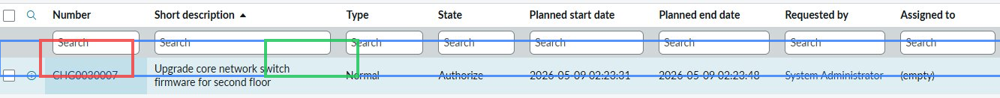

> **Red highlight:** CHG0030007 in the Number column - the unique reference for this change. This is the number that all communications, approvals, and audit entries will reference.
>
> **Green highlight:** The State column showing **Authorize** - the change has progressed past Assess and is now pending formal approval. The list view provides a high-level overview of all change records and is the standard view used by the CAB during their weekly review meeting.
>
> **Blue highlight:** The entire row is highlighted to show the record summary: Normal type, Authorize state, planned dates 2026-05-09, requested by System Administrator. All fields are visible at a glance without opening the record.

---

### Phase 9 - Simulate CAB Approval

**Step 9.1 - Open the Approval Record and Approve the Change**

Open CHG0030007 and navigate to the Approvals section. The approval record shows the change has been routed to **Howard Johnson** for review. Set the approval State to **Approved** and save.

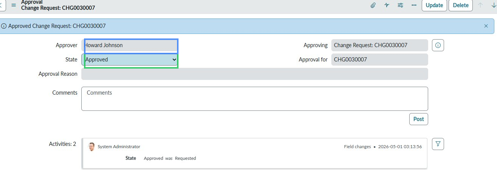

> **Green highlight:** The State field in the Approval record showing **Approved**. In a production environment this action would be taken by the designated approver (Howard Johnson) after reviewing the planning documentation. In the PDI, the System Administrator is simulating the approval to demonstrate the workflow.
>
> **Blue highlight:** The Approver field showing Howard Johnson. In a real CAB scenario, the change would be presented at the weekly CAB meeting, the committee would review the risk, implementation plan, and backout plan, and Howard Johnson would either approve, reject, or request more information.
>
> The Activities section shows the audit trail: State changed from Requested to Approved at 2026-05-01 03:13:56. This timestamp and the approver's name are permanently recorded and cannot be edited.

---

### Phase 10 - Move to Implement and Add Work Notes

**Step 10.1 - Advance the State to Implement and Log the Start of Work**

Once approved, advance the change State to **Implement** to indicate that the maintenance window has opened and work has begun. Add a Work Note to document the live status.

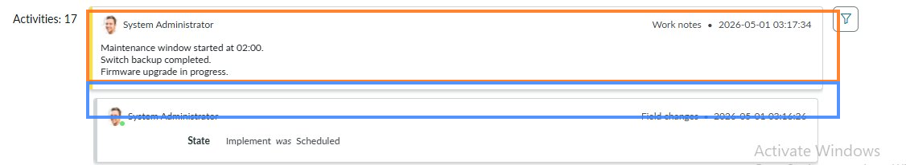

> **Orange highlight:** The Work Note added at 2026-05-01 03:17:34 reading: "Maintenance window started at 02:00. Switch backup completed. Firmware upgrade in progress." This note documents three facts in real time: the maintenance window started on schedule, the configuration backup (Step 2 of the implementation plan) was completed successfully, and the firmware upgrade is actively being applied. Anyone monitoring the change queue can see the live status without calling the engineer.
>
> **Blue highlight:** The field change entry below showing State changed from Scheduled to Implement at 03:16:26. This is the automated audit entry that ServiceNow creates for every state transition. The work note and the state change together create an unambiguous record of when work began and what the first status was.

---

### Phase 11 - Move to Review and Document Completion

**Step 11.1 - Advance to Review State and Add Completion Work Note**

After the implementation steps and test plan checks are complete, advance the State to **Review** to indicate that the technical work is done and the outcome is being assessed. Add a Work Note confirming the results.

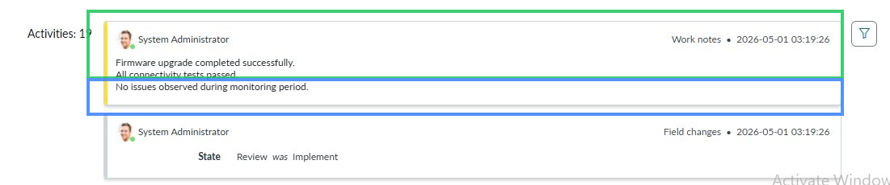

> **Green highlight:** The Work Note at 2026-05-01 03:19:26 reading: "Firmware upgrade completed successfully. All connectivity tests passed. No issues observed during monitoring period." This note directly maps to the test plan: all connected devices pinged successfully, internet access confirmed, file server accessible, VoIP phones re-registered. The 30-minute monitoring period (Step 5 of the implementation plan) produced no alerts.
>
> **Blue highlight:** The field change entry showing State changed from Implement to Review at 03:19:26. The Review state is where the CAB or change owner confirms that the work achieved the expected outcome before the record is formally closed.

---

### Phase 12 - Complete the Closure Information

**Step 12.1 - Fill in the Closure Information Tab Before Closing**

Navigate to the **Closure Information** tab on the change record. Set the Close code and add the Close notes before moving the state to Closed.

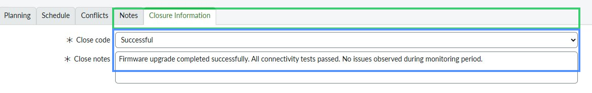

> **Green highlight:** The Close code field set to **Successful**. ServiceNow requires a close code before a change can be moved to Closed state. Close codes provide structured data for reporting - over time, the proportion of Successful, Unsuccessful, and Cancelled close codes tells the CAB how effective the change process is and where planning is failing.
>
> **Blue highlight:** The Close notes field reading: "Firmware upgrade completed successfully. All connectivity tests passed. No issues observed during monitoring period." Close notes are the formal summary of what happened. They should be written for an audience who was not present - a future analyst reviewing this record six months from now should be able to understand exactly what was done and what the outcome was.

---

### Phase 13 - Confirm the Change is Closed in the List View

**Step 13.1 - Return to the Change List and Verify the Closed State**

Navigate back to Change > All and confirm that CHG0030007 now shows as **Closed** in the list view. The record lifecycle is complete.

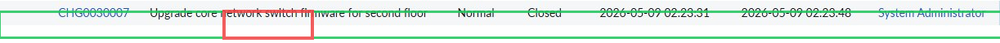

> **Green highlight:** The full row for CHG0030007 in the list view, confirming all key fields are correct: Normal type, Closed state, planned dates 2026-05-09, requested by System Administrator.
>
> **Red highlight:** The State column showing **Closed**. A closed change record is immutable. No further state transitions are possible. The record now exists permanently as the audit trail for the firmware upgrade - what was planned, who approved it, what was done, and what the outcome was.

---

## Before and After Comparison

### Before - Change Request Not Raised

| What existed | What was missing |
|---|---|
| A known firmware vulnerability on the second-floor switch | Any formal record of the planned work |
| A verbal plan from the network team | A CHG number to reference in communications |
| Knowledge that a maintenance window was needed | Documented risk assessment and rollback plan |
| No visibility for the CAB or management | No approval trail if something went wrong |

Without a change record, the firmware upgrade would be an invisible, undocumented event. If the upgrade caused a connectivity outage during working hours the next day, there would be no audit trail, no approved rollback plan, and no record that the work was ever authorised.

---

### After - CHG0030007 Raised, Approved, and Closed Successful

| Field | Value | What it enables |
|---|---|---|
| **Number** | CHG0030007 | Unique reference for all communications and incident correlation |
| **Short description** | Upgrade core network switch firmware for second floor | Immediately understood by anyone in the change queue |
| **Risk** | Moderate | CAB calibrates their review depth to the assessed risk level |
| **Implementation plan** | 5 steps, specific and sequenced | Engineer has a runbook - no improvisation during the maintenance window |
| **Backout plan** | Restore config backup, 15 min recovery | If anything fails, the recovery action is pre-decided and timed |
| **Test plan** | 4 specific checks | Pass/fail criteria defined before work begins |
| **Approver** | Howard Johnson - Approved | Work was formally authorised before it started |
| **Close code** | Successful | Outcome recorded for CAB metrics and future reference |
| **State** | Closed | Record is permanent and immutable |

---

## The ITIL Normal Change Lifecycle

Every state in the Normal Change workflow serves a specific purpose. Understanding why each state exists prevents the common mistake of treating state transitions as administrative box-ticking.

```
NEW
  Purpose:   Initial record creation
  Who acts:  Change requester
  What:      Fill in all planning fields - description, risk,
             implementation plan, backout plan, test plan

ASSESS
  Purpose:   Technical and risk review by the change team
  Who acts:  Change manager or technical lead
  What:      Validate that the plan is complete, risk is accurate,
             and the backout plan is genuinely executable

AUTHORIZE
  Purpose:   Formal CAB approval before work can begin
  Who acts:  Change Advisory Board or designated approver
  What:      Approve or reject based on risk, scheduling,
             and resource availability

SCHEDULED
  Purpose:   Work is confirmed for a specific maintenance window
  Who acts:  Change scheduler
  What:      Dates locked, stakeholders notified, resources confirmed

IMPLEMENT
  Purpose:   Active execution of the change
  Who acts:  Technical team performing the work
  What:      Follow the implementation plan, add work notes in real time,
             invoke backout plan immediately if any step fails

REVIEW
  Purpose:   Post-implementation assessment
  Who acts:  Change owner and CAB
  What:      Confirm test plan passed, no unexpected side effects,
             outcome matches what was planned

CLOSED
  Purpose:   Permanent record with close code and closure notes
  Who acts:  Change manager
  What:      Set close code (Successful / Unsuccessful / Cancelled),
             add closure notes, record is now immutable

CANCELED (alternate path)
  Purpose:   Change withdrawn before implementation
  Who acts:  Change requester or CAB
  What:      Document why the change was cancelled,
             record remains for audit purposes
```

---

## Help Desk Ticket Notes

See `TICKET_NOTES.md` in this folder for field-by-field notes on CHG0030007, the change lifecycle walkthrough, risk assessment guidance, and observations on ServiceNow change management behaviour.

---

## Outcome and Validation

| Check | Result |
|---|---|
| Normal change type selected from the template picker | Pass |
| CHG0030007 assigned automatically on form submission | Pass |
| Short description set to specific, realistic scenario | Pass |
| Risk set to Moderate with justification in description | Pass |
| Implementation plan completed with 5 sequential steps | Pass |
| Backout plan documented with specific actions and 15-minute recovery estimate | Pass |
| Test plan completed with 4 specific acceptance criteria | Pass |
| Record saved and state automatically advanced to Assess | Pass |
| CHG0030007 visible in change list with correct fields | Pass |
| State advanced through Assess and Authorize | Pass |
| Approval record created, approver Howard Johnson, state set to Approved | Pass |
| State advanced to Implement | Pass |
| Work note added documenting live maintenance window status | Pass |
| State advanced to Review | Pass |
| Completion work note added confirming all tests passed | Pass |
| Closure Information tab completed with Successful close code | Pass |
| Close notes added confirming the outcome | Pass |
| State advanced to Closed | Pass |
| CHG0030007 visible in list view with Closed state | Pass |

---

## What I Learned

1. **Change management is incident prevention.** Every field in the change form exists because unplanned, undocumented work causes incidents. The implementation plan prevents ad hoc improvisation. The backout plan prevents extended outages when something fails. The test plan prevents a technician from closing the maintenance window before confirming the work actually worked.

2. **The backout plan must be specific.** A backout plan that says "revert if needed" gives the engineer nothing to work with at 03:00 during a failed upgrade. A backout plan that says "restore the configuration backup from Step 2 and reboot to previous firmware version - estimated 15 minutes" tells the engineer exactly what to do and how long it will take. The difference is the difference between a controlled recovery and an extended outage.

3. **State transitions are formal gates, not administrative steps.** Moving a change from Assess to Authorize is a statement that the CAB has reviewed and accepted the plan. Moving from Authorize to Implement is a statement that approval exists. A change that skips Authorize and goes straight to Implement has no approval record - if something goes wrong, there is no audit trail showing the work was sanctioned.

4. **Work notes during Implement are real-time documentation.** Adding a work note that says "Maintenance window started at 02:00. Switch backup completed. Firmware upgrade in progress" serves two purposes: it gives anyone monitoring the change queue a live status update, and it creates a timestamped record of the exact sequence of events during the maintenance window. If the upgrade had failed, those timestamps would be critical for post-incident analysis.

5. **Close codes feed reporting.** Successful, Unsuccessful, and Cancelled are not just labels - they are the data points that allow the CAB to measure change success rates over time. A consistent pattern of Unsuccessful changes in a particular category signals a problem with planning or risk assessment that needs to be addressed at the process level.

6. **The Normal Change lifecycle is the template for all complex ITSM work.** Every workflow in ServiceNow that involves risk - problem management, release management, configuration management - follows the same principle: plan before acting, document what you planned, get approval from someone who is not doing the work, execute against the plan, verify the outcome, record the result.

---

## Real World Relevance

In enterprise environments, every planned change to infrastructure - firmware upgrades, server migrations, network reconfigurations, application deployments - requires a change record before work begins. The Change Advisory Board reviews the queue weekly (or daily for fast-moving environments) and approves, rejects, or defers changes based on risk, scheduling conflicts, and resource availability.

A change record that is incomplete - missing the backout plan, with a vague implementation plan, or with no test criteria - will be rejected by the CAB and sent back for rework. The engineer who raised it must update it and resubmit for the next CAB cycle. This is not a failure of the process - it is the process working correctly. The CAB is the last line of defence before potentially disruptive work begins on production infrastructure.

The skills demonstrated in this lab - writing a detailed implementation plan, defining a specific and time-bounded backout plan, setting clear test acceptance criteria, and documenting the work in real time with work notes - are the skills that distinguish a junior technician from a senior engineer trusted to work on production systems. The technical ability to apply firmware is table stakes. The ability to plan, document, and communicate the work is what makes it safe to do.

---

## Troubleshooting Reference

| Situation | Correct Action | Common Mistake |
|---|---|---|
| Submit button does not advance the state | Check all mandatory fields - the red asterisks indicate required fields. ServiceNow will not save without them. Scroll up to see any validation errors. | Clicking Submit and assuming the state advanced when the form actually failed validation and stayed on the same page |
| Approval record not appearing after Authorize state | Check that the Assignment group is set correctly. Approval routing depends on the assignment group and the change type. If no approver is configured for the group, the approval record will not generate. | Advancing to Authorize and waiting for an approval that was never triggered because no approver was configured |
| Work notes not saving | Click Update or Save after adding the work note. ServiceNow does not auto-save work notes as you type. | Typing a work note, navigating away, and losing the content because Update was not clicked |
| Conflict status shows Not Run | Click the Check Conflicts button in the Schedule tab if you want to verify no other changes are scheduled for the same CI or time window. Not Run is the default until conflicts are actively checked. | Assuming Not Run means no conflicts exist - it means the check has not been performed |
| State will not advance past Authorize | The approval record must be in Approved state before the change can move to Scheduled or Implement. Check the Approvals tab and confirm the approval state. | Trying to advance the state before the approval record has been set to Approved |
| Close code field is missing | The Close code and Close notes fields only appear in the Closure Information tab. They are not visible on the main form until the change is in Review or Closed state. | Looking for Close code on the main form and concluding it does not exist |
| CHG number gap in the sequence | Normal behaviour. If a form is opened and closed without saving, the reserved number is released but the sequence increments. Gaps in CHG numbers are expected and do not indicate missing records. | Assuming a gap means a record was deleted or that there is a system error |
