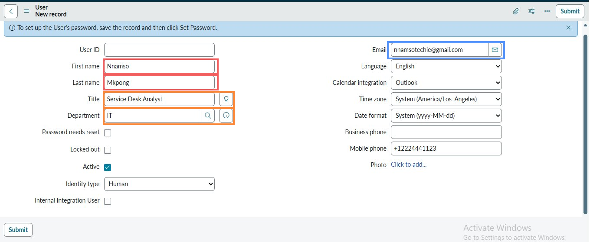
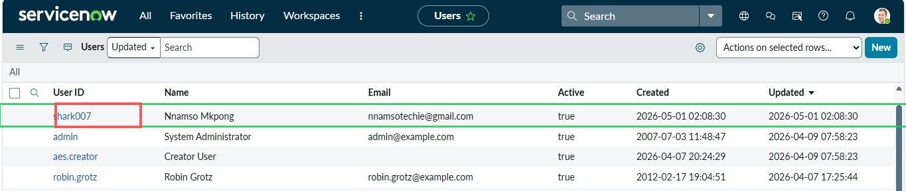
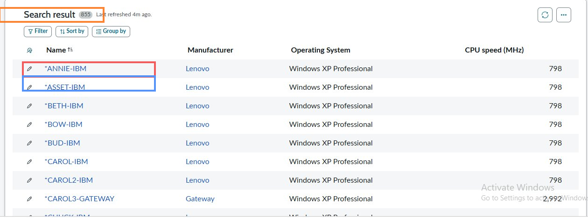
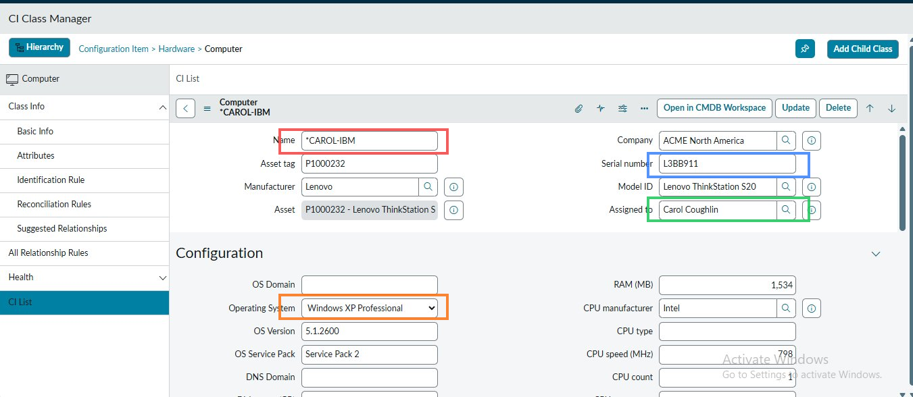
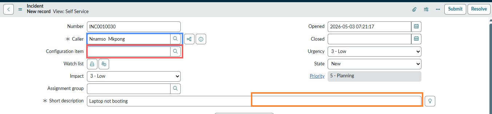
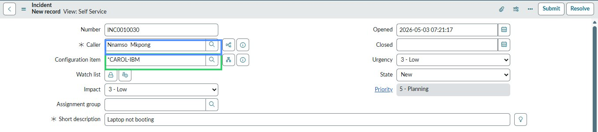
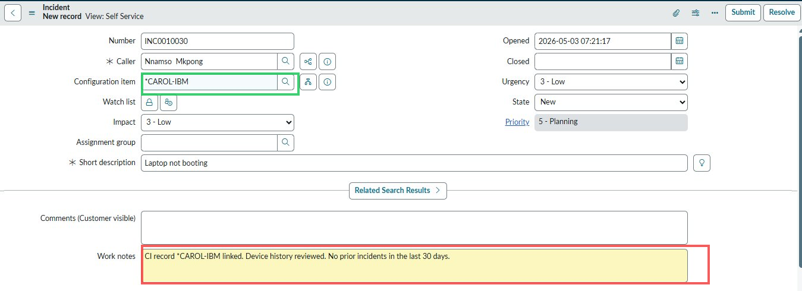

# User Administration and the CMDB

> **Author:** Nnamso Mkpong
>
> **Domain:** ServiceNow - User Administration, Role Management, Configuration Management Database (CMDB)
>
> **Environment:** ServiceNow Personal Developer Instance (PDI) - developer.servicenow.com
>
> **Completed:** May 2026

---

## Objective

Create a user record in ServiceNow, assign the correct ITIL role, verify the user appears in the system as a valid caller, explore the Configuration Management Database to locate a Configuration Item, and link that CI to an incident to demonstrate asset-aware support. Prove end to end that a new analyst can be onboarded, that the CMDB contains actionable device records, and that incidents can be tied to the physical assets they relate to.

---

## Business Scenario

> **2 tasks, 1 lab - May 2026**
>
> Task 1: A new analyst named Nnamso Mkpong has just joined the IT team. Before they can log or manage incidents in ServiceNow, they need a user account with the correct role. You have been asked to create the account, assign the ITIL role, and confirm the account is active and searchable in the system.
>
> Task 2: A user has called the service desk to report that their laptop is not booting. Before logging the incident, the analyst needs to locate the device in the CMDB, review its configuration record and support history, link it to the incident, and add a work note confirming the asset check was done.

These two tasks represent the two foundational skills of structured IT support: knowing who is in the system (user administration) and knowing what is in the system (the CMDB). Without correct user records, access control breaks down and incident routing becomes unreliable. Without CMDB linkage, incidents exist in isolation - the support team has no visibility into asset history, no way to spot repeat failures on the same device, and no asset-to-incident relationship for reporting.

---

## Environment and Tools Used

| Component | Detail |
|---|---|
| **Platform** | ServiceNow Personal Developer Instance (PDI) |
| **Modules used** | User Administration, CMDB, Incident Management |
| **New user created** | Nnamso Mkpong - shark007 |
| **User title** | Service Desk Analyst |
| **User department** | IT |
| **Role assigned** | itil |
| **CI used** | *CAROL-IBM (Lenovo ThinkStation S20) |
| **Incident created** | INC0010030 |
| **Incident description** | Laptop not booting |
| **Caller on incident** | Nnamso Mkpong |

---

## Understanding User Roles in ServiceNow

> **Roles control what a user can see and do in ServiceNow. Assigning the wrong role - or no role at all - is one of the most common onboarding mistakes. A user without a role will log in and see an empty interface with no modules.**

```
COMMON SERVICENOW ROLES

itil
  Purpose:   Standard role for service desk analysts
  Access:    Create, read, update incidents, problems, changes
             View CMDB records and CI details
             Add work notes and comments
             Cannot access admin configuration panels
  Use for:   Any front-line support analyst or ITSM practitioner

itil_admin
  Purpose:   Service desk team lead or manager
  Access:    All itil permissions plus admin of ITSM records
             Can close and delete records others cannot
  Use for:   Senior analysts, team leads

admin
  Purpose:   Full system administrator
  Access:    All modules, all configuration, all data
  Use for:   ServiceNow administrators only - not support analysts

approver_user
  Purpose:   Change and request approval only
  Access:    View and approve change requests and service requests
  Use for:   Managers and CAB members who approve but do not work tickets

KEY RULE
  Assign the minimum role necessary for the job function.
  itil is the correct starting role for a new service desk analyst.
  Do not assign admin to analysts - it bypasses all access controls.
```

---

## Understanding the CMDB

The Configuration Management Database is ServiceNow's record of every asset, system, and service that the IT team is responsible for. Each record in the CMDB is called a Configuration Item (CI). A CI can represent a physical device (a laptop, a server, a switch), a software application, a service, or a logical component of the infrastructure.

```
WHAT THE CMDB STORES FOR EACH CI

Identity
  Name, asset tag, serial number, model ID
  Manufacturer, company, assigned to, department

Configuration
  Operating system, OS version, OS service pack
  RAM, CPU type, CPU speed, CPU count
  DNS domain, OS domain

Relationships
  What other CIs does this CI depend on?
  What services does it support?
  What incidents, changes, and problems have been raised against it?

History
  Every incident linked to this CI is visible in the Incidents related list
  Every change request linked appears in the Changes related list
  The full support history of a device is captured automatically
  when analysts link incidents and changes correctly

WHY THIS MATTERS
  Without CMDB linkage:
    Incident A is logged. The laptop is fixed. The record is closed.
    Three months later the same laptop fails again.
    The new analyst has no idea this device has failed before.
    The same diagnosis is done again. Time is wasted.

  With CMDB linkage:
    Incident A is linked to CI *CAROL-IBM.
    When the laptop fails again and Incident B is raised,
    the analyst opens the CI record and sees Incident A in the history.
    They know immediately: this device has a recurring problem.
    They escalate to a hardware replacement rather than another repair.
```

CMDB linkage turns isolated incidents into a connected support history. It is the difference between treating symptoms and identifying root causes.

---

## Steps Performed

---

### Phase 1 - Create the New User Record

**Step 1.1 - Navigate to User Administration and Complete the New User Form**

Navigate to **User Administration > Users** in the ServiceNow top navigation bar. Click **New** to open a blank user record. Complete all identity fields for the new analyst.

Fields completed:
- **First name:** Nnamso
- **Last name:** Mkpong
- **Title:** Service Desk Analyst
- **Department:** IT
- **Email:** nnamsotechie@gmail.com
- **Mobile phone:** +12224441123
- **Language:** English
- **Calendar integration:** Outlook
- **Time zone:** System (America/Los_Angeles)
- **Active:** checked
- **Identity type:** Human



> **Red highlight:** First name (Nnamso) and Last name (Mkpong) fields. These two fields together form the display name that will appear in every incident Caller search, every work note attribution, and every approval record. They must be accurate - a typo here propagates across the entire instance.
>
> **Orange highlight:** Title (Service Desk Analyst) and Department (IT). Title and Department are not cosmetic fields. They feed into reporting, access group membership rules, and user lookup filters. Setting Department to IT ensures this user appears in the correct department roster and can be routed to the right assignment groups.
>
> **Blue highlight:** Email field showing nnamsotechie@gmail.com. The email address is the primary contact point for system notifications - password resets, SLA breach alerts, approval requests, and ticket updates are all sent to this address. An incorrect email means the analyst will never receive system notifications.
>
> The blue banner at the top reads: "To set up the User's password, save the record and then click Set Password." Password configuration is a separate step after the record is saved. This is intentional - ServiceNow decouples identity creation from credential assignment to support scenarios where an account is created before the person starts.

---

### Phase 2 - Confirm the User Appears in the Users List

**Step 2.1 - Verify the New User Record is Active and Visible**

After clicking Submit, the system saves the record and returns to the Users list view. Confirm that Nnamso Mkpong appears at the top of the list, sorted by most recently updated.



> **Green highlight:** The complete row for Nnamso Mkpong - User ID shark007, email nnamsotechie@gmail.com, Active: true, Created: 2026-05-01 02:08:30. The green highlight confirms this is the newly created, active account.
>
> **Red highlight:** The User ID field showing **shark007**. The User ID is the login credential for this account. It is separate from the display name and is what the analyst will type into the login screen. ServiceNow generates or accepts User IDs on creation - in production environments, User IDs are typically provisioned by Active Directory or an identity management system and synced into ServiceNow automatically.
>
> The list shows four accounts total: the new analyst (shark007), the System Administrator, Creator User (a PDI system account), and Robin Grotz. The new account is at the top of the list because the list is sorted by Updated date descending, and the new record was just created.

---

### Phase 3 - Assign the ITIL Role

**Step 3.1 - Open the User Record and Add the itil Role**

Open the Nnamso Mkpong user record. Scroll to the Roles related list at the bottom of the form. Click **Edit** and add the **itil** role. Save the role assignment.


> **Green highlight:** The **itil** role name in the Role column. This is the role that grants the analyst access to the Incident, Problem, and Change modules, the CMDB, work notes, and all standard service desk functions. Without this role, the analyst can log in but will see an empty navigation with no access to any ITSM module.
>
> **Blue highlight:** The State column showing **Active**. An Active role assignment means the role is currently in effect. A role can exist in a user record in an inactive state - for example, if an analyst is temporarily suspended or if a role has been staged for future activation.
>
> **Orange highlight:** The Inherited column showing **false**. Inherited: false means this role was assigned directly to this user, not inherited from a group membership. If the analyst were added to a group that has the itil role assigned at group level, Inherited would show true and the individual assignment would not be needed. Direct assignment and group inheritance both work - direct assignment is used here because the analyst has not yet been added to any groups.

---

### Phase 4 - Verify the User Appears as a Valid Caller

**Step 4.1 - Search for the New User in the Caller Field of a New Incident**

Open a new Incident form and click the search icon on the Caller field. Type the analyst's name and confirm that Nnamso Mkpong appears in the lookup results.


> **Green highlight:** The Nnamso Mkpong row at the top of the caller search results, showing First name: Nnamso, Last name: Mkpong, Email: nnamsotechie@gmail.com. This confirms the user record is active, correctly configured, and indexed in the caller lookup. A user who cannot be found in the Caller field cannot be set as the reporter on any incident - their issues would have to be logged under someone else's account, which corrupts assignment routing and SLA tracking.
>
> The search returns three results: Nnamso Mkpong, System Administrator, and Creator User. The new account is at the top, confirming it was created successfully and is immediately available for use in incident logging.
>
> This validation step matters because a user record that was saved with a configuration error - wrong identity type, inactive flag set, or missing required field - might not appear in caller lookups even if it shows in the Users list. The caller search test is the definitive confirmation that the account is fully functional.

---

### Phase 5 - Explore the CMDB Computer CI List

**Step 5.1 - Navigate to the Computer CI Class and Review the Asset List**

Navigate to **Configuration > CI Classes > Computer**. The CMDB Computer list opens showing all computer configuration items registered in the instance.



> **Orange highlight:** The search result count showing **855 results**. The CMDB in this PDI instance contains 855 computer CI records. In an enterprise environment this number can be in the tens or hundreds of thousands, covering every laptop, desktop, server, and virtual machine the organisation manages. The Last refreshed indicator shows this list was current 4 minutes ago - CMDB data is refreshed automatically by discovery tools in production instances.
>
> **Red highlight:** The *ANNIE-IBM record at the top of the list. The asterisk prefix on CI names in this PDI instance indicates records that came from the demonstration data set. Each row shows Name, Manufacturer, Operating System, and CPU speed - the core identification fields for a computer CI at list level.
>
> **Blue highlight:** The *ASSET-IBM record directly below. Both ANNIE-IBM and ASSET-IBM show Lenovo as the manufacturer and Windows XP Professional as the OS. In a production CMDB, the OS field is critical for patch management - the change team uses it to identify which devices need a specific security update applied.
>
> The list columns - Name, Manufacturer, Operating System, CPU speed - represent the minimum information needed to identify a device remotely. An analyst who receives a call about a laptop problem can search this list by name or serial number and immediately know the device spec before the caller describes it.

---

### Phase 6 - Open a CI Record and Review Its Detail Fields

**Step 6.1 - Open the *CAROL-IBM Computer CI and Inspect All Key Fields**

Click on the *CAROL-IBM record to open the full CI detail view. This is the CI that will be linked to the incident in the next phase.



> **Red highlight:** The Name field showing ***CAROL-IBM**. This is the CI's unique identifier within the CMDB - the name that will be searched and selected when linking to an incident. CI names in enterprise environments follow a naming convention that encodes the device type, location, or assigned user into the name (for example WIN11-NM-04 encodes the OS, location code, and device number).
>
> **Blue highlight:** The Serial number field showing **L3BB911**. The serial number is the physical world identity of this device. It is what an engineer reads off the sticker on the bottom of the laptop to confirm they are working on the right machine. When a device is replaced, the old CI is retired and a new CI is created with the new serial number - the serial number is what prevents the CI record from being reused for a different physical device.
>
> **Green highlight:** The Assigned to field showing **Carol Coughlin**. Assigned to links the CI to the person who uses this device day to day. This is how the CMDB connects an asset to a person. When an incident comes in from Carol Coughlin about her laptop, the analyst can search for *CAROL-IBM in the CI field and immediately confirm they have the right device because the Assigned to field matches the caller.
>
> **Orange highlight:** The Operating System field showing **Windows XP Professional** with OS Version 5.1.2600 and OS Service Pack: Service Pack 2. The OS details determine which patches apply, which applications are compatible, and which support runbooks are relevant. In production, this field is populated and kept current by the ServiceNow Discovery tool, which scans devices on the network and updates CI records automatically.
>
> Additional fields visible: Manufacturer (Lenovo), Model ID (Lenovo ThinkStation S20), Asset tag (P1000232), RAM (1,534 MB), CPU manufacturer (Intel), CPU speed (798 MHz). Together these fields give the support team a complete picture of the device without physically examining it.

---

### Phase 7 - Open a New Incident and Locate the Configuration Item Field

**Step 7.1 - Create an Incident for the Laptop Fault Before Linking the CI**

Open a new Incident form. Set the Caller to Nnamso Mkpong and the Short description to "Laptop not booting". Note that the Configuration item field is currently empty. This represents the state of the incident before the CMDB link is made.



> **Blue highlight:** The Caller field showing **Nnamso Mkpong** - the newly created analyst account is immediately usable as a caller on an incident. This confirms the user creation and role assignment from Phase 1 through Phase 3 are all working correctly.
>
> **Red highlight:** The Configuration item field, currently empty. An incident with no CI linked is an isolated record. It will be resolved and closed with no connection to the physical asset. If the same laptop fails again next month, the next analyst will have no way of knowing this incident happened. The CI field is what creates the asset support history.
>
> **Orange highlight:** The Short description reading "Laptop not booting" - a clear, specific description of the fault. INC0010030 was assigned automatically when the form opened.
>
> The incident is in New state with Impact 3 - Low and Urgency 3 - Low, producing Priority 5 - Planning. This priority reflects a single-user device fault that does not affect critical business operations. Before submitting, the Configuration item field must be populated.

---

### Phase 8 - Search for the CI and Link It to the Incident

**Step 8.1 - Use the Configuration Item Search to Link *CAROL-IBM**

Click the search icon on the Configuration item field. Type the CI name to search. Select ***CAROL-IBM** from the results. The field populates with the CI name. Save the incident.



> **Green highlight:** The Configuration item field now populated with ***CAROL-IBM**. This single field change creates a permanent bidirectional link between INC0010030 and the *CAROL-IBM CI record. The link is visible from both sides: on the incident, the CI field shows the device. On the CI record, the Incidents related list will now show INC0010030.
>
> **Blue highlight:** The Caller field still showing Nnamso Mkpong, confirming both the caller identity and the asset link are correctly set before the record is saved.
>
> When this incident is saved, two things happen simultaneously: the incident record is stored with a reference to *CAROL-IBM, and the *CAROL-IBM CI record is updated to include INC0010030 in its incident history. The CMDB relationship is created in both directions automatically. No manual update to the CI record is required.

---

### Phase 9 - Add a Work Note Confirming the CI Review

**Step 9.1 - Document the Asset Check in a Work Note on the Incident**

With the CI linked and the incident saved, add a Work Note to document that the CI record was reviewed and the device history was checked before proceeding with the investigation.



> **Green highlight:** The Configuration item field still showing ***CAROL-IBM** - confirming the CI link persisted after the work note was added. The CI association is permanent for the life of the incident record.
>
> **Red highlight:** The Work notes field containing the completed note: "CI record *CAROL-IBM linked. Device history reviewed. No prior incidents in the last 30 days." This work note does three things: it confirms the CI was linked (audit evidence that the step was done), it confirms the device history was checked (demonstrating CMDB-aware support practice), and it records the outcome of the history check (no prior incidents in 30 days, which rules out a recurring hardware failure as the immediate cause).
>
> The Work notes field has a yellow background - this is the ServiceNow visual indicator that a note is being composed but not yet posted. The note is posted when the record is saved or updated. Work notes are visible to the support team only, not to the caller. The caller would receive a Comment in the Comments (Customer visible) field above.
>
> This work note is the documentation that proves the analyst followed the asset-aware support process. In an audit, this note is the evidence that the CMDB was consulted before investigation began.

---

## Before and After Comparison

### Before - No User Record, No CI Linkage

| What existed | What was missing |
|---|---|
| A new analyst who needed system access | Any ServiceNow account for Nnamso Mkpong |
| A laptop fault reported by a caller | An incident record with CI linkage |
| 855 computer CIs in the CMDB | No connection between the incident and the device |
| Device history stored in the CI record | No way to see prior incidents on the same laptop |

Without the user record, the new analyst cannot log in, cannot be set as a caller, and cannot receive system notifications. Without the CI link, the incident is blind to the device's history and the device's history is blind to the incident.

---

### After - User Active, Role Assigned, CI Linked

| Item | Value | What it enables |
|---|---|---|
| **User ID** | shark007 | Login credential for ServiceNow access |
| **Display name** | Nnamso Mkpong | Searchable in Caller, Assigned to, and Approver fields |
| **Role** | itil - Active - Not inherited | Full service desk analyst access to all ITSM modules |
| **Caller validation** | Appears in incident Caller search | Confirmed the account is fully functional before first use |
| **CI examined** | *CAROL-IBM | Device identity, spec, owner, and OS confirmed before linking |
| **CI linked to** | INC0010030 | Incident and device are now connected in both directions |
| **Work note** | CI history reviewed - no prior incidents in 30 days | Audit evidence that CMDB-aware support process was followed |

---

## The Purpose of the CMDB in Asset-Aware Support

The CMDB is the foundation of every advanced ITIL practice beyond basic incident management. Its purpose is to give the support team a complete, accurate, and current map of the IT environment - every device, every service, every relationship.

**Asset-aware support** means that when an incident is raised, the analyst does not just record the symptom. They also identify the asset involved, review its history, and use that history to make faster and better decisions.

Without the CMDB, support is reactive and stateless. Each incident is a fresh problem with no context. The analyst starts from zero every time. A laptop that has failed four times in six months looks identical to a laptop that has never had a problem - both generate an incident with the same short description, and both get the same generic troubleshooting steps applied.

With the CMDB and correct CI linkage, the analyst opens the CI record and sees the full history before touching the keyboard. Four incidents in six months is a pattern. That pattern changes the response: instead of running diagnostics again, the analyst escalates to hardware replacement. The CMDB turned a fifth repair attempt into a permanent resolution.

The CMDB also enables:

- **Change impact assessment** - Before a firmware upgrade is applied to a server, the CMDB shows which services depend on that server. The change team can notify affected users in advance.
- **SLA accuracy** - If an incident is linked to a CI that supports a critical service, the SLA tier applied to the incident can be automatically escalated based on the CI's criticality classification.
- **Asset lifecycle tracking** - The CMDB records when a device was provisioned, who it was assigned to, every incident and change raised against it, and when it was decommissioned. This is the complete lifecycle record for compliance and auditing.
- **Recurring failure detection** - CMDB reports can surface devices with the highest incident counts over a rolling period. These devices are flagged for proactive replacement before they cause a serious outage.

The work note added in Step 9 - "CI record *CAROL-IBM linked. Device history reviewed. No prior incidents in the last 30 days" - is not just documentation. It is evidence that the analyst consulted the CMDB before proceeding. In regulated environments, demonstrating that the CMDB was used as part of the support process is a compliance requirement, not a recommendation.

---

## Help Desk Ticket Notes

See `TICKET_NOTES.md` in this folder for field-by-field notes on the user record, the itil role, the *CAROL-IBM CI record, and INC0010030, along with observations on CMDB behaviour and user administration practices in ServiceNow.

---

## Outcome and Validation

| Check | Result |
|---|---|
| User Administration > Users navigation found | Pass |
| New user record created for Nnamso Mkpong with all identity fields | Pass |
| User ID shark007 assigned and active | Pass |
| User visible in the Users list sorted by most recently updated | Pass |
| itil role assigned directly to the user record | Pass |
| Role state showing Active and Inherited: false | Pass |
| User appears in incident Caller field search results | Pass |
| Caller search returns correct name, email, and is immediately selectable | Pass |
| CMDB Computer CI list navigated via Configuration > CI Classes > Computer | Pass |
| 855 CI records visible in the Computer class list | Pass |
| *CAROL-IBM CI record opened and all key fields reviewed | Pass |
| Name, serial number, assigned to, OS, and RAM all populated on the CI | Pass |
| New incident INC0010030 created with caller Nnamso Mkpong | Pass |
| Configuration item field located on the incident form | Pass |
| *CAROL-IBM searched and linked to INC0010030 via Configuration item field | Pass |
| CI link persisted after saving the incident record | Pass |
| Work note added to INC0010030 documenting the CI history review | Pass |
| Work note confirms no prior incidents in the last 30 days | Pass |

---

## What I Learned

1. **Roles are not optional - they are the access control mechanism.** A user without a role in ServiceNow can log in but cannot do anything meaningful. The itil role is the gateway to all service desk functions. Assigning it correctly at onboarding is the single most important step in user setup. An analyst who cannot find the Incident module on their first day was almost certainly created without the itil role.

2. **The User ID and display name serve different purposes.** The User ID (shark007) is the login credential. The display name (Nnamso Mkpong) is the searchable identity in all module lookup fields. Both must be correct. A display name with a typo will cause the user to be unsearchable in Caller lookups, breaking the incident logging workflow.

3. **Validating a user in the Caller field is the definitive onboarding test.** A user can appear correctly in the Users list but still fail to appear in Caller searches if there is a configuration error - wrong identity type, inactive status, or missing fields. The Caller search test is the end-to-end proof that the account is fully operational.

4. **A CI record is not just inventory - it is a support intelligence record.** The fields on *CAROL-IBM - serial number, assigned to, OS, model - give the analyst everything needed to understand the device before the caller finishes describing the problem. The Incidents related list turns that static information into a dynamic support history.

5. **The Configuration item field on an incident is the most important field most analysts ignore.** Priority, category, and assignment group get attention because they affect routing and SLA. The Configuration item field gets skipped because it is not mandatory. But it is the field that makes incident management intelligent rather than transactional. Every laptop incident that is closed without a CI link is a missed data point in the CMDB history.

6. **Work notes are the audit trail for analyst behaviour, not just incident content.** Logging "CI record *CAROL-IBM linked. Device history reviewed. No prior incidents in the last 30 days" is not just a status update. It is proof that the analyst followed the correct process. In an environment with SLA compliance requirements or ISO 20000 certification, that proof matters.

7. **The CMDB enables escalation intelligence.** Knowing there are no prior incidents in 30 days on *CAROL-IBM means a standard diagnostic approach is appropriate. If the history had shown three incidents in 30 days, the correct response is immediate hardware escalation, not another repair attempt. The CMDB is what makes that distinction possible.

---

## Real World Relevance

User administration and CMDB management are not advanced ServiceNow skills - they are the foundational skills that every other ITSM practice depends on. In an enterprise environment, these two capabilities are running constantly: new starters are provisioned daily, devices are added and retired from the CMDB continuously, and incidents are being linked to CIs in every support interaction.

The skills demonstrated in this lab map directly to two real job functions. User administration is typically performed by the IT operations team or a provisioning desk - the process of creating accounts, assigning roles, and validating access is a daily workflow. CMDB linkage is performed by every service desk analyst on every incident they log - it is not a special task but the expected default behaviour.

A service desk analyst who links every incident to the correct CI, without being told to, is an analyst who understands what they are building: a complete, searchable, reportable history of every device in the organisation. That history is what allows the support team to detect patterns, justify hardware replacements, measure asset reliability, and demonstrate compliance. It starts with one analyst, on one incident, linking one CI. This lab is that starting point.

---

## Troubleshooting Reference

| Situation | Correct Action | Common Mistake |
|---|---|---|
| New user does not appear in the Caller search after creation | Check that the Active checkbox is ticked on the user record and that the Identity type is set to Human. Integration or service account identity types are excluded from user-facing lookups. | Creating the account and assuming it will be searchable without checking the Active and Identity type fields |
| itil role was added but the analyst still cannot see incident module | Check that the role State is Active, not Requested or Inactive. Also confirm the role was saved - navigate away from the user record and return to verify the role appears in the related list. | Adding the role but navigating away before the save completed, leaving the role assignment unsaved |
| Configuration item field is not visible on the incident form | The Configuration item field may be hidden by the current view. Check which view is active in the top bar - Self Service view hides some fields. Switch to the Default or ITIL view via the view selector. | Assuming the field does not exist because it is not visible in the current view |
| CI search returns no results when typing a name | Try a shorter search term - ServiceNow CI search is a contains search, not a starts-with search. Searching "CAROL" will find *CAROL-IBM but searching "*CAROL-IBM" with the asterisk may not match depending on instance configuration. | Typing the full exact CI name including special characters and getting no results because the search does not match the prefix character |
| Work note disappears after navigating away without saving | Always click Update or Submit after adding a work note. ServiceNow does not auto-save in-progress notes. If the browser is refreshed before saving, the note content is lost permanently. | Typing a work note, then navigating to another record, and losing the note because Update was not clicked |
| CI incidents related list does not show the linked incident | The related list updates after the incident is fully saved, not when the CI field is populated. If the CI record is opened immediately after linking, allow a moment for the relationship to propagate. Refreshing the CI record usually resolves the display. | Opening the CI record before the incident save has fully completed and concluding the link did not work |
| User ID field is empty after form submission | User ID is a required field that the admin must either enter manually or allow the system to generate. If left blank and the system does not auto-generate, the record will save without a login credential. Set the User ID and click Update. | Submitting a user record with an empty User ID and discovering the analyst cannot log in because no credential was set |
