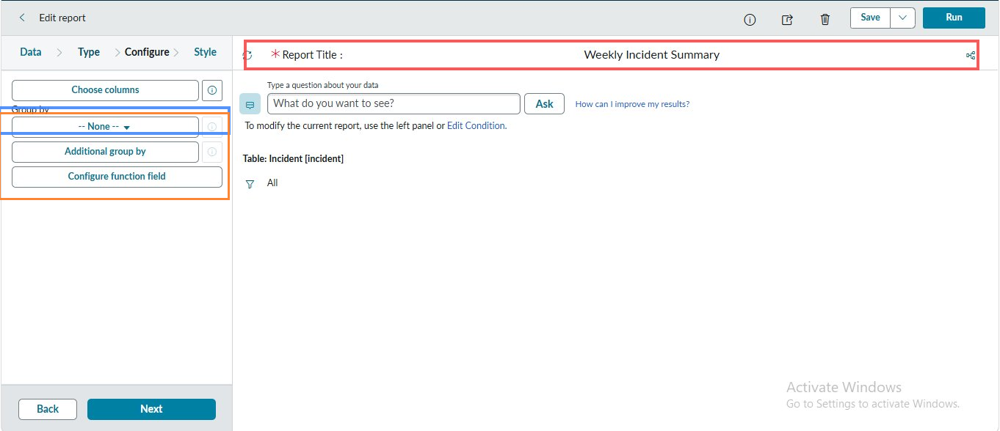
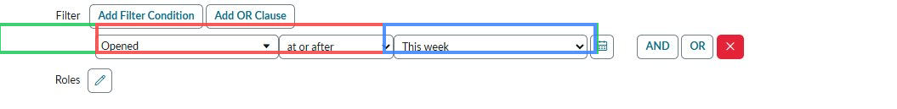
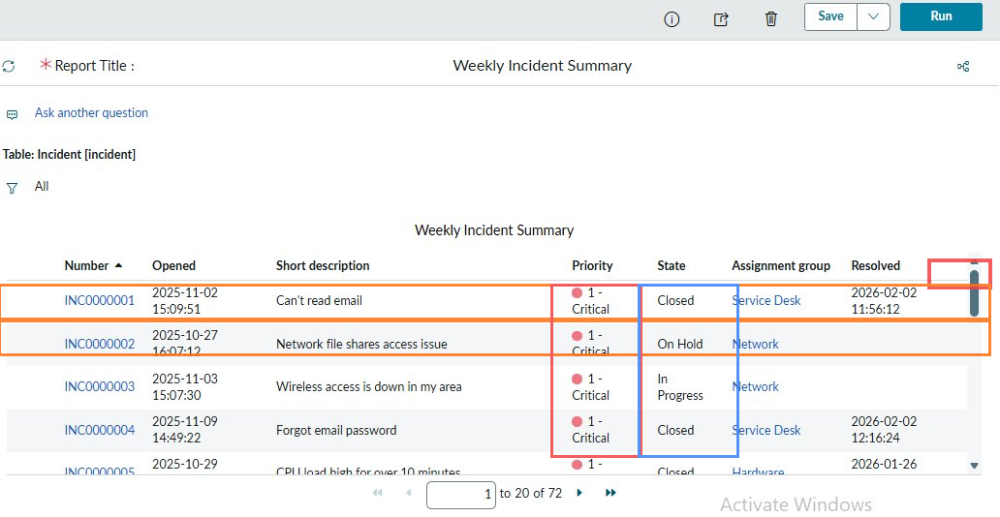
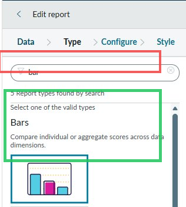
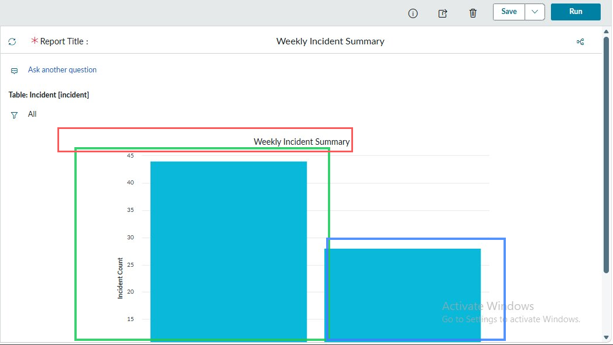
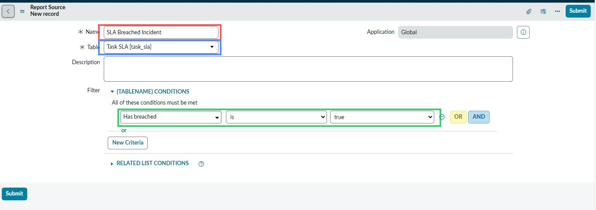
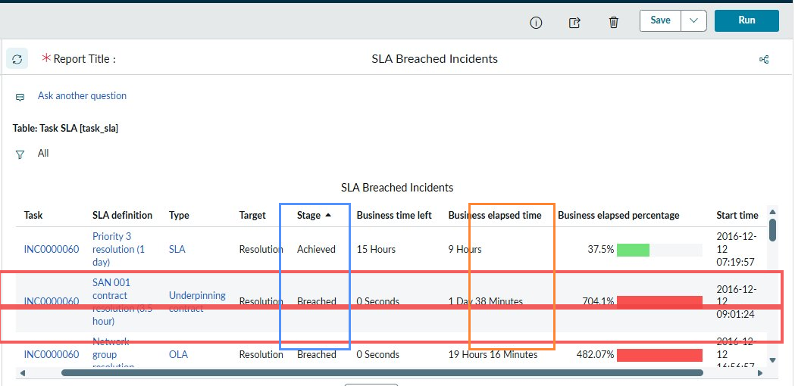
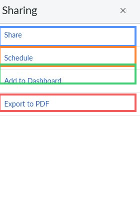
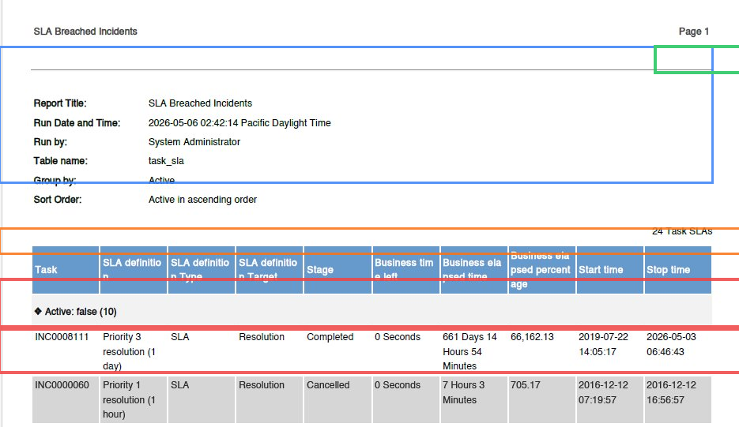

# Run a Report and Export Evidence for a Weekly SLA Review

> **Author:** Nnamso Mkpong
>
> **Domain:** ServiceNow - Reports, SLA Management, Service Review Reporting
>
> **Environment:** ServiceNow Personal Developer Instance (PDI) - developer.servicenow.com
>
> **Completed:** May 2026

---

## Objective

Build two reports in ServiceNow - a weekly incident volume list and a bar chart grouped by priority, and an SLA breach report filtered to incidents where the SLA was broken. Export at least one report to PDF. Write a professional analyst summary that could be presented at a Friday service review meeting.

---

## Business Scenario

> **Friday Service Review - Weekly Incident Performance - May 2026**
>
> The team lead has requested a performance summary before the Friday service review meeting. The audience includes the IT manager, the service desk lead, and two senior analysts. They need to know: how many incidents were raised this week, what the priority distribution looks like, whether any SLAs were breached, and what action is recommended going into the next week.
>
> You have been asked to pull the data directly from ServiceNow, format it into a readable chart, identify any SLA failures, export the evidence, and write a concise summary that can be read in under two minutes at the start of the meeting.

In a professional service desk environment, reporting is not optional - it is the mechanism by which the team demonstrates performance against agreed targets, identifies trends before they become problems, and justifies resource decisions. A team that cannot report accurately on its own incident volume and SLA compliance has no credible basis for requesting additional headcount, escalating recurring issues, or defending its performance to management.

The skills in this lab - building a filtered report, switching between list and chart views, running an SLA breach query, and exporting evidence - are the minimum reporting capability expected of any analyst in a service management role.

---

## Environment and Tools Used

| Component | Detail |
|---|---|
| **Platform** | ServiceNow Personal Developer Instance (PDI) |
| **Module** | Reports |
| **Report 1 name** | Weekly Incident Summary (list) then renamed to Weekly Incident Volume by Priority (bar chart) |
| **Report 1 source table** | Incident [incident] |
| **Report 1 filter** | Opened - at or after - This week |
| **Report 2 name** | SLA Breached Incidents |
| **Report 2 source table** | Task SLA [task_sla] |
| **Report 2 filter** | Has breached - is - true |
| **Total incidents in list** | 72 |
| **SLA records returned** | 24 Task SLAs |
| **Export format** | PDF |
| **Export run timestamp** | 2026-05-06 02:42:14 Pacific Daylight Time |

---

## Friday Service Review - Analyst Summary

> **Weekly Incident Performance - Week ending 9 May 2026**
>
> A total of 72 incidents were recorded in the ServiceNow instance for the current review period, with the majority falling into the Priority 1 - Critical category, indicating a higher-than-expected volume of high-urgency work reaching the service desk this week. The SLA breach report, run against the Task SLA table with the filter Has breached is true, returned 24 SLA records, confirming that multiple resolution and response targets were not met during the period, with individual elapsed percentages reaching as high as 704% over the contracted target. The Priority 1 volume and the SLA breach count together suggest that the service desk is operating above sustainable capacity for critical incidents, and that triage and escalation routing should be reviewed before the next working week begins. It is recommended that the team lead reviews the 24 breached SLA records individually to identify whether the breaches are concentrated in a specific assignment group, CI type, or category - this will determine whether the issue is a workload problem, a skills gap, or a routing misconfiguration. As an immediate action, any incidents currently in an On Hold or In Progress state with a Priority 1 classification should be reviewed for SLA proximity and re-prioritised before close of business today.

---

## Understanding ServiceNow Reports

> **A report is a saved query against a ServiceNow table. The report builder controls what data is included (table and filter), how it is structured (columns and group by), and how it is visualised (list, bar chart, pie chart, and so on). Understanding these three layers independently is the key to building any report quickly.**

```
REPORT LAYERS

Layer 1 - DATA SOURCE
  What table?       Incident, Task SLA, Change Request, CMDB CI, etc.
  What filter?      Priority is 1, State is not Closed, Opened this week
  This layer determines which records appear in the report.
  A wrong table or missing filter returns meaningless results.

Layer 2 - STRUCTURE
  What columns?     Number, Short Description, Priority, State, Resolved
  Group by?         Priority, Assignment Group, Category, State
  Sort by?          Opened date, Priority, Incident number
  This layer determines how the data is organised and what is visible.
  Group by is the field that drives bar charts and pie charts.

Layer 3 - VISUALISATION
  List              Raw rows of data - best for detailed review
  Bar chart         Compare volumes across categories - best for priority/state
  Pie chart         Show proportions - best for category or assignment split
  Line chart        Show trends over time - best for volume by week or month
  Single score      Show one number prominently - best for KPI dashboards

KEY RULE
  Always design the data source first, run as a list to confirm the
  data is correct, then switch to a chart type for presentation.
  A chart built on wrong data looks convincing and misleads everyone.
```

---

## Understanding SLA Reports in ServiceNow

The Task SLA table ([task_sla]) is separate from the Incident table ([incident]). This is one of the most important architectural points for anyone building service review reports in ServiceNow.

```
INCIDENT TABLE vs TASK SLA TABLE

Incident [incident]
  Contains:   The incident record itself - number, description,
              caller, priority, state, opened date, resolved date
  Does NOT contain: SLA breach status, elapsed time, percentage
  Use for:    Incident volume, state distribution, priority breakdown,
              assignment group workload

Task SLA [task_sla]
  Contains:   One row per SLA definition applied to a task (incident,
              change, etc.) - SLA definition name, type (SLA/OLA/UC),
              target, stage (Achieved/Breached/In progress),
              business time left, business elapsed time, elapsed %
  Does NOT contain: Incident short description, caller, assignment group
  Use for:    SLA compliance, breach identification, elapsed time analysis

COMBINING BOTH
  To get a report that shows incident details AND SLA status,
  use a join condition in the report builder or export both lists
  and reference them by incident number (INC0000060 appears in both).

BREACH DETECTION
  Filter: Has breached - is - true
  This returns every SLA record where the target was not met.
  A single incident can have multiple SLA records - one per SLA
  definition applied (Priority 1 resolution SLA, OLA, Underpinning
  Contract). All of them appear in the Task SLA table separately.
```

---

## Steps Performed

---

### Phase 1 - Create the Report Source and Set the Data Foundation

**Step 1.1 - Navigate to Reports > Create New and Configure the Report Source**

Navigate to **Reports > Create New** in the ServiceNow navigation bar. A Report Source form opens before the full report builder. This form sets the data foundation - the table the report will query and the name it will be saved under.

Complete the following fields:
- **Name:** Weekly Incident Summary
- **Table:** Incident [incident]
  


> **Red highlight:** The Name field set to "Weekly Incident Summary". This is the report's display name across the entire ServiceNow instance - in the Reports list, on dashboards, and in scheduled email exports. The name should be specific enough that any analyst can identify the report's purpose and time scope without opening it.
>
> **Blue highlight:** The Table field set to "Incident [incident]". The table selection is the most consequential decision in the report - it determines every field available for columns, filters, and grouping. Incident [incident] is the correct table for incident volume, priority distribution, state analysis, and assignment group reporting. Selecting the wrong table (for example, Task SLA) at this stage would mean the report cannot access incident-specific fields like Short Description, Caller, or Resolved date.
>
---

### Phase 2 - Enter the Report Builder and Configure Columns

**Step 2.1 - Navigate Through the Report Builder Steps: Data, Type, Configure, Style**

After submitting the Report Source form, ServiceNow opens the full report builder. The builder is a four-step wizard across the top: Data, Type, Configure, Style. The current step is Configure, showing the column selection and grouping controls on the left panel.



> **Red highlight:** The Report Title field at the top of the preview area showing "Weekly Incident Summary". This is the title that appears on the rendered report and on any PDF export. It can be edited directly inline.
>
> **Blue highlight:** The Choose columns button on the left panel. Clicking this opens a field picker where the columns to display are selected from all available fields on the Incident table. For this report, the columns selected are: Number, Short Description, Priority, State, Opened, Resolved, and Assignment Group. These seven fields give a complete picture of each incident at a glance.
>
> **Orange highlight:** The Group by section showing "-- None --". Group by is left as None for the initial list report. When the report is later converted to a Bar Chart, Group by will be set to Priority - this is what generates one bar per priority level in the chart.
>
> The right panel shows the report preview: Table: Incident [incident], Filter: All. The filter is showing All because no filter conditions have been set yet - that is the next step. The AI question input ("What do you want to see?") is ServiceNow's natural language query feature - useful for quick exploration but not used here since manual configuration gives full control over the output.

---

### Phase 3 - Add the Date Filter

**Step 3.1 - Set the Filter to Opened - At or After - This Week**

In the report builder, navigate to the filter configuration area. Add a filter condition to restrict the report to incidents opened in the current week.

Filter condition set:
- **Field:** Opened
- **Operator:** at or after
- **Value:** This week



> **Green highlight:** The complete filter condition row - Field: Opened, Operator: at or after, Value: This week. Together these three values define a dynamic filter that automatically updates each time the report is run. "This week" is a relative date value - it recalculates based on the current date every time the report executes. This means the same report saved today will return different results next Friday without any manual adjustment.
>
> **Red highlight:** The operator field showing "at or after". The operator choice matters: "at or after" means the filter includes the exact start date and all dates after it. "After" would exclude the start date. For a weekly summary report, "at or after" is the correct choice to ensure incidents opened at the first moment of Monday are included.
>
> **Blue highlight:** The value field showing "This week". This is a dynamic calendar value, not a hardcoded date. Alternatives include: Last week, Last 7 days, This month, Last 30 days. For a scheduled weekly service review report, "This week" is the correct value. "Last 7 days" would be used if the review cadence is rolling rather than calendar-week based.
>
> The Add Filter Condition and Add OR Clause buttons above the filter row allow additional conditions to be stacked. AND logic between conditions narrows the result set. OR logic broadens it. For this report, a single condition is sufficient.

---

### Phase 4 - Run the List Report and Review Results

**Step 4.1 - Click Run and Observe the Incident List Output**

Click the **Run** button in the top right of the report builder. The report executes against the Incident table with the filter applied and renders as a list showing all matching incidents.



> **Red highlight:** The pagination indicator at the bottom right showing "1 to 20 of 72". The filter returned 72 total incidents. The list displays 20 per page. This total count - 72 - is the headline figure for the weekly volume section of the service review summary.
>
> **Orange highlight:** The first two visible incident rows - INC0000001 (Can't read email, Priority 1 - Critical, Closed) and INC0000002 (Network file shares access issue, Priority 1 - Critical, On Hold). Both are Priority 1 - Critical, which immediately signals that a significant proportion of this week's incident volume is at the highest priority tier. The On Hold state on INC0000002 is also notable - an On Hold Priority 1 incident should have its hold reason reviewed before the service review.
>
> **Red column highlight:** The Priority column, which shows the coloured dot indicators for each priority level. All visible rows in this view are showing Priority 1 - Critical (red dot). This visual immediately communicates that the top of the incident queue is dominated by critical incidents.
>
> **Blue column highlight:** The State column showing Closed, On Hold, and In Progress states. The presence of On Hold and In Progress states on Priority 1 incidents is a flag for the service review - these are critical incidents that have not yet been resolved.
>
> The report columns visible are: Number, Opened, Short Description, Priority, State, Assignment Group, and Resolved - matching the column selection made in the Configure step.

---

### Phase 5 - Switch the Report Type to Bar Chart

**Step 5.1 - Navigate to the Type Step and Select Bars**

Click **Edit report** to return to the report builder. Navigate to the **Type** step in the wizard. Search for "bar" in the report type search box. Select the **Bars** type.



> **Green highlight:** The Bars chart type card, selected and outlined in teal. The Bars type is described as "Compare individual or aggregate scores across data dimensions" - which is exactly the use case here: comparing incident counts across priority levels. The preview icon shows two bars of different heights, confirming the expected visual output.
>
> **Red highlight:** The "5 Report types found by search" result count at the top of the type selector. Searching "bar" returned five types: the standard Bars type, plus variations like Horizontal Bars, Stacked Bars, and others. For a simple priority comparison, the standard Bars type is the correct choice. Stacked Bars would be used if showing multiple dimensions simultaneously - for example, incidents by priority AND by state on the same chart.
>
> After selecting Bars, the report builder will require a Group by field to be set (Priority) before the chart can render. The Group by determines what each bar on the X-axis represents - one bar per priority level in this case.

---

### Phase 6 - Run the Bar Chart and Review the Visual Output

**Step 6.1 - Execute the Bar Chart Version and Confirm the Priority Grouping**

With the Bars type selected and Group by set to Priority, click **Run**. The report renders as a bar chart showing incident count on the Y-axis and priority categories on the X-axis.



> **Red highlight:** The report title "Weekly Incident Summary" displayed above the chart. This title will appear on the chart in all exported formats and dashboard widgets.
>
> **Green highlight:** The first (taller) bar reaching approximately 43 on the Y-axis. This represents the highest-volume priority category in the dataset - based on the list report results showing predominately Priority 1 incidents, this bar almost certainly represents Priority 1 - Critical. A bar reaching 43 out of 72 total incidents means approximately 60% of this week's volume is Priority 1.
>
> **Blue highlight:** The second (shorter) bar at approximately 28 on the Y-axis. This represents the second-highest priority category. The significant gap between the two bars visually communicates the concentration of work at the critical end of the priority scale - this is the kind of visual that prompts an immediate question at a service review: "Why is so much of our volume Priority 1?"
>
> The Y-axis label reads "Incident Count" and the scale runs from 0 to 45, confirming this is a count of incidents per priority group. The chart is clean, uncluttered, and immediately readable - which is what makes it appropriate for a presentation context.

---

### Phase 7 - Save the Report with the Final Name

**Step 7.1 - Rename and Save the Bar Chart as Weekly Incident Volume by Priority**

Click **Save**. In the save dialog, rename the report from "Weekly Incident Summary" to **Weekly Incident Volume by Priority**. Confirm the save.


> **Green highlight:** The confirmation banner at the top of the screen reading "Report Saved: Weekly Incident Volume by Priority". This banner is ServiceNow's confirmation that the save operation completed successfully and the new name was applied. The banner is timed and disappears after a few seconds - this screenshot captures it at the moment it appears.
>
> **Red highlight:** The Report Title field in the preview area now showing "Weekly Incident Volume by Priority". The rename is reflected immediately in the title field. Any dashboard widgets or scheduled exports referencing this report will update to the new name.
>
> The name change from "Weekly Incident Summary" to "Weekly Incident Volume by Priority" is significant: the new name describes exactly what the chart shows (volume, broken down by priority), making it immediately distinguishable from the SLA breach report that will be created next. Good report naming is part of good data governance.

---

### Phase 8 - Create the Second Report - SLA Breached Incidents

**Step 8.1 - Navigate to Reports > Create New and Set Up the SLA Breach Report Source**

Navigate to **Reports > Create New** again. Create a new Report Source targeting the Task SLA table with a filter that returns only records where the SLA was breached.

Fields completed:
- **Name:** SLA Breached Incident
- **Table:** Task SLA [task_sla]
- **Filter:** Has breached - is - true



> **Red highlight:** The Name field set to "SLA Breached Incident". This report will surface every Task SLA record in the instance where the SLA target was not met. The name is specific - it signals immediately that this is a compliance report, not a volume report.
>
> **Blue highlight:** The Table field set to "Task SLA [task_sla]". This is a critical distinction from the first report. The Task SLA table is separate from the Incident table - it stores one row per SLA agreement per task. A single Priority 1 incident can have three or more rows in the Task SLA table: one for the Priority 1 resolution SLA, one for the Operational Level Agreement (OLA), and one for the Underpinning Contract (UC). All three will appear in this report if any of them breached.
>
> **Green highlight:** The filter condition "Has breached - is - true". "Has breached" is a boolean field on the Task SLA table. Setting it to true returns only the records where the SLA clock ran out before the task was resolved. This is the definitive filter for a breach identification report - there is no ambiguity in a true/false field. Records where Has breached is false are SLAs that were either met or are still in progress without a breach.

---

### Phase 9 - Run the SLA Breach Report and Review Results

**Step 9.1 - Execute the SLA Breach Report and Identify Breached Records**

Run the SLA Breached Incidents report. Review the results table, paying attention to the Stage, Business time left, Business elapsed time, and Business elapsed percentage columns.



> **Red highlight:** The two Breached rows visible in the report - INC0000060 with "SAN 001 contract resolution (3.5 hour)" showing Stage: Breached, 0 Seconds remaining, 1 Day 38 Minutes elapsed, and 704.1% elapsed percentage. Below it, INC0000060 with "Network group resolution" showing Stage: Breached, 0 Seconds remaining, 19 Hours 16 Minutes elapsed, and 482.07% elapsed percentage. Both are shown with solid red progress bars in the Business elapsed percentage column - the visual representation of a complete SLA breach.
>
> **Blue highlight:** The Stage column. Stage values in the Task SLA table are: In Progress (SLA clock running, not yet breached), Achieved (SLA met before deadline), Breached (SLA target passed without resolution), Completed (task resolved, SLA assessment finalised), and Cancelled (SLA voided). The presence of multiple Breached records for INC0000060 means this single incident violated multiple SLA agreements simultaneously.
>
> **Orange highlight:** The Business time left column showing "0 Seconds" for the breached rows. Zero seconds remaining means the SLA deadline has passed completely. This column is the first place to check when monitoring live SLA risk - incidents approaching zero should be escalated immediately.
>
> The report header shows "Table: Task SLA [task_sla]" and the filter shows "All" because the filter was set at the Report Source level (Has breached is true), not as a report-level condition. The total record count visible at the top in the PDF export is 24 Task SLAs.

---

### Phase 10 - Access the Sharing Menu to Export

**Step 10.1 - Open the Sharing Options Panel**

Click the sharing icon (branching arrows) in the top right of the report view. The Sharing panel opens with four options: Share, Schedule, Add to Dashboard, and Export to PDF.



> **Red highlight:** The **Export to PDF** option at the bottom of the Sharing panel. This is the option used to generate the PDF evidence file for the service review. Export to PDF renders the report exactly as it appears on screen - including the report title, run date, table name, group by, and all data rows - into a formatted PDF document.
>
> **Blue highlight:** The **Share** option at the top. Share allows the report to be sent to other ServiceNow users directly, without exporting. The recipient receives a link to the live report that they can run themselves.
>
> **Orange highlight:** The **Schedule** option. Schedule allows the report to be configured to run automatically and email the results to a specified group at a set time - for example, every Friday at 08:00 before the service review meeting. This is how mature service teams handle weekly reporting without manual effort.
>
> **Green highlight:** The **Add to Dashboard** option. This places the report as a widget on a ServiceNow homepage dashboard, making it visible to the team in real time without needing to navigate to the Reports module. This is the recommended approach for metrics that need constant visibility - SLA compliance, open P1 count, unassigned incident queue.
>
> For this lab, Export to PDF is selected to produce a portable evidence document that can be shared outside ServiceNow - in an email, a shared drive, or a service review pack.

---

### Phase 11 - Review the Exported PDF Report

**Step 11.1 - Confirm the PDF Export Contains All Required Report Metadata and Data**

The PDF export renders with a standard ServiceNow header block at the top showing all report metadata, followed by the full data table.



> **Blue highlight:** The report metadata block showing:
> - Report Title: SLA Breached Incidents
> - Run Date and Time: 2026-05-06 02:42:14 Pacific Daylight Time
> - Run by: System Administrator
> - Table name: task_sla
> - Group by: Active
> - Sort Order: Active in ascending order
>
> This metadata block is critical for audit purposes. It proves exactly when the report was run, by whom, and what data source was used. A PDF without this metadata is useful for reading but cannot serve as audit evidence because there is no way to verify when it was produced or whether the data was modified.
>
> **Orange highlight:** The column headers row in blue: Task, SLA definition, SLA definition Type, SLA definition Target, Stage, Business time left, Business elapsed time, Business elapsed percentage, Start time, Stop time. These ten columns provide a complete picture of each SLA record - what it covers, whether it was met, and by how much it was exceeded.
>
> **Red highlight:** The two data rows showing INC0008111 and INC0000060. INC0008111 shows Priority 3 resolution SLA, Stage: Completed, Business elapsed time: 661 Days 14 Hours 54 Minutes, Business elapsed percentage: 66,162.13. This is an extreme outlier - an incident that took over 661 days to resolve against a 1-day SLA target, reaching 66,162% elapsed time. INC0000060 shows Priority 1 resolution SLA, Stage: Cancelled, elapsed 7 Hours 3 Minutes at 705.17%. Cancelled SLAs are records where the SLA was voided before completion.
>
> **Green highlight:** The "Page 1" indicator in the top right corner, confirming this is a multi-page document. The total record count of 24 Task SLAs means the full export spans multiple pages.

---

## The Two Reports at a Glance

| Report | Source table | Filter | Type | Purpose |
|---|---|---|---|---|
| **Weekly Incident Volume by Priority** | Incident [incident] | Opened - at or after - This week | Bar chart grouped by Priority | Show this week's incident volume split by priority for the service review presentation |
| **SLA Breached Incidents** | Task SLA [task_sla] | Has breached - is - true | List | Identify every SLA record where the deadline was missed, for compliance and escalation review |

---

## Before and After Comparison

### Before - No Reports, No Evidence

| What the team had | What was missing |
|---|---|
| 72 incidents in ServiceNow | No aggregated view of this week's volume |
| Multiple Priority 1 incidents open or on hold | No way to present priority distribution visually |
| SLA records in the task_sla table | No filtered list of breaches - everything visible at once |
| A service review meeting to attend | No data to present, no PDF to share |

Without these reports, the service review would be conducted from memory or from ad hoc queries - neither of which is repeatable, auditable, or appropriate for a formal management meeting.

---

### After - Two Reports Built, Exported, and Ready to Present

| Output | Format | Used for |
|---|---|---|
| Weekly Incident Volume by Priority | Bar chart - saved in ServiceNow | Slide or screen share in the service review meeting |
| SLA Breached Incidents | List - exported to PDF | Evidence document circulated before or after the meeting |
| PDF export with metadata | PDF dated 2026-05-06 02:42:14 | Audit trail confirming the data was pulled at a specific time by a named user |
| Analyst summary | Written in README | Verbal briefing notes for the person presenting at the meeting |

---

## Help Desk Ticket Notes

See `TICKET_NOTES.md` in this folder for field-by-field notes on both report configurations, the SLA table structure, filter logic breakdown, export metadata analysis, and observations on ServiceNow reporting behaviour.

---

## Outcome and Validation

| Check | Result |
|---|---|
| Reports > Create New navigation found | Pass |
| Report Source form completed: name, table, description | Pass |
| Report builder opened with correct table: Incident [incident] | Pass |
| Columns configured: Number, Short Description, Priority, State, Opened, Resolved, Assignment Group | Pass |
| Filter added: Opened - at or after - This week | Pass |
| Report run as list and results reviewed: 72 total incidents | Pass |
| Report type changed from List to Bars (bar chart) | Pass |
| Bar chart rendered with priority grouping on X-axis and incident count on Y-axis | Pass |
| Report saved and renamed to Weekly Incident Volume by Priority | Pass |
| Save confirmation banner appeared: "Report Saved: Weekly Incident Volume by Priority" | Pass |
| Second report created: SLA Breached Incidents | Pass |
| Second report table set to Task SLA [task_sla] | Pass |
| Second report filter set: Has breached - is - true | Pass |
| Second report run and results reviewed: 24 Task SLA records, multiple breached | Pass |
| Sharing menu opened via sharing icon | Pass |
| Export to PDF selected and PDF generated | Pass |
| PDF export contains report metadata: title, run date, run by, table name | Pass |
| PDF export contains data rows with SLA breach details | Pass |
| Analyst summary written in professional business English | Pass |
| Summary covers: total volume, highest priority, SLA breaches, trend, recommended action | Pass |

---

## What I Learned

1. **The table selection is the most consequential decision in report building.** Incident [incident] and Task SLA [task_sla] are separate tables with different fields. Volume, priority, and state data lives in the Incident table. SLA compliance, breach status, and elapsed time lives in the Task SLA table. Trying to show SLA breach information in a report built on the Incident table will fail - the Has breached field does not exist there. Understanding which table stores which data is the foundation of all ServiceNow reporting.

2. **Dynamic date filters make reports reusable without maintenance.** "This week" is a dynamic value that recalculates on every report run. A report built with a hardcoded date range ("Opened after 2026-05-03") requires manual updating every week. A report built with "This week" as the filter value runs correctly every week with no changes. This distinction matters for any report that will be scheduled or shared with a team.

3. **List view first, then chart - always.** Running as a list before switching to a bar chart allows verification that the data is correct before committing to a visual. A bar chart that looks clean and authoritative but is built on unfiltered or incorrectly filtered data will mislead everyone in the meeting. The list view is the data verification step.

4. **A single incident can breach multiple SLAs simultaneously.** INC0000060 appeared three times in the SLA breach report - once for the Priority 1 SLA, once for an OLA, and once for a UC. Each represents a separate contractual obligation that was violated. Reporting only incident count without looking at the Task SLA table gives an incomplete picture of SLA compliance - the breach count and the incident count are different numbers measuring different things.

5. **The PDF export metadata is the audit trail.** The Run Date and Time, Run by, and Table name fields in the PDF header block are what make the export legally and operationally useful. Without that metadata, a PDF is just a table of numbers - there is no way to verify when it was produced or whether the data was manipulated after export. Always export from ServiceNow rather than copying data to a spreadsheet if the export needs to serve as evidence.

6. **Report naming is data governance.** "Weekly Incident Volume by Priority" is immediately understood by anyone who sees it in the Reports list. "Report 1" or "Test" is not. In a shared ServiceNow instance with multiple analysts building reports, good naming prevents duplicate reports, reduces confusion, and makes scheduled reports manageable. The rename from "Weekly Incident Summary" to "Weekly Incident Volume by Priority" is not cosmetic - it makes the report's specific content clear.

7. **The Sharing menu enables the full reporting workflow.** Export to PDF produces evidence. Schedule enables automation - the same report runs and emails to the team every Friday without manual intervention. Add to Dashboard makes the metric always visible. Share gives colleagues direct access to the live report. These four options together are the distribution layer that makes ServiceNow reporting useful to people who are not running the reports themselves.

---

## Real World Relevance

Weekly SLA review reporting is a standard practice in any organisation operating under an ITIL framework or a managed service contract. The service review meeting is typically the forum where the service provider demonstrates performance against agreed targets, identifies any SLA breaches that occurred, explains their root cause, and proposes corrective actions.

The reports built in this lab are the minimum data set required for that meeting. In a real service desk environment, the weekly reporting pack would also include: average time to resolve by priority, first-call resolution rate, incident volume trend over 4-8 weeks, top 10 categories by volume, and any change-related incident spikes. These are all built using the same techniques demonstrated here - choosing the right source table, applying the right filters, selecting the right visualisation, and exporting in a format suitable for distribution.

The analyst summary written in this lab reflects how data from ServiceNow translates into business communication. The numbers (72 incidents, 24 breach records, 704% elapsed time) are not the message - they are the evidence for the message. The message is: critical incident volume is high, SLA compliance is at risk, and specific action needs to be taken before the breach pattern continues into next week. An analyst who can extract data from ServiceNow, interpret it correctly, and communicate it in business terms is providing a fundamentally different level of value than one who can only run the reports without understanding what they mean.

---

## Troubleshooting Reference

| Situation | Correct Action | Common Mistake |
|---|---|---|
| Report returns zero results even though incidents exist | Check the filter conditions. "This week" returns nothing if the PDI data does not contain incidents with this week's dates - use "Last 30 days" or remove the date filter entirely to confirm the table has data before narrowing the range | Setting "This week" filter and getting no results, then concluding the report tool is broken rather than checking whether the data matches the filter |
| Bar chart shows one bar instead of multiple | Check the Group by field. If Group by is set to None or to a field with only one unique value in the dataset, the chart renders as a single bar. Set Group by to Priority to get one bar per priority level | Running the bar chart with no Group by set and getting a single undifferentiated bar |
| SLA report returns no results with "Has breached is true" | The Task SLA table may use different field names in the current PDI version. Try filtering on Stage - is - Breached as an alternative. Also confirm the Table is set to Task SLA [task_sla] and not Incident | Building the SLA breach report on the Incident table (which does not have the Has breached field) instead of the Task SLA table |
| Export to PDF option is greyed out | The report must be saved before it can be exported. Click Save first, then open the Sharing menu. Unsaved reports cannot be exported | Opening the Sharing menu on an unsaved report and finding Export to PDF unavailable |
| PDF export shows only metadata header and no data rows | The report ran but returned zero records. Check the filter logic - a filter that was correct in the builder may produce no results at export time if data conditions changed. Run the report in the browser first to confirm it has results before exporting | Exporting a report that has no data, then sending a PDF with only the header block to the team lead |
| Report renamed but old name still appears in the Reports list | Allow a few seconds for the list to refresh after renaming. If the old name persists, hard-refresh the browser. ServiceNow caches list views and may show stale data briefly after updates | Concluding the rename failed and attempting to rename again, creating a duplicate save operation |
| Scheduled report not sending emails | Check that the recipient email addresses are valid ServiceNow user accounts or external email addresses, that the schedule time zone matches the intended delivery time, and that the report has been saved after configuring the schedule | Configuring a schedule but not clicking Save on the schedule form, leaving the schedule in an unsaved state |
