# Run a Report and Export Evidence for a Weekly SLA Review

> **Author:** Nnamso Mkpong
>
> **Domain:** ServiceNow - Reports, SLA Management, Service Review Reporting
>
> **Environment:** ServiceNow Personal Developer Instance (PDI) - developer.servicenow.com
>
> **Completed:** May 2026

---

## Objective

Build two reports in ServiceNow - a weekly incident volume list converted to a bar chart grouped by priority, and an SLA breach report filtered to Task SLA records where the SLA was broken. Export at least one report to PDF. Write a professional analyst summary suitable for presenting at a Friday service review meeting.

---

## Business Scenario

> **Friday Service Review - Weekly Incident Performance - May 2026**
>
> The team lead has requested a performance summary before the Friday service review. The audience includes the IT manager, the service desk lead, and two senior analysts. They need to know: how many incidents were raised this week, what the priority distribution looks like, whether any SLAs were breached, and what action is recommended going into the next week.
>
> You have been asked to pull the data directly from ServiceNow, format it into a readable chart, identify any SLA failures, export the evidence, and write a concise summary that can be read in under two minutes at the start of the meeting.

In a professional service desk environment, reporting is not optional - it is the mechanism by which the team demonstrates performance against agreed targets, identifies trends before they become problems, and justifies resource decisions. A team that cannot report accurately on its own incident volume and SLA compliance has no credible basis for requesting additional headcount, escalating recurring issues, or defending its performance to management.

The skills in this lab - building a filtered report, switching between list and chart views, running an SLA breach query, and exporting evidence - are the minimum reporting capability expected of any analyst in a service management role.

---

## Environment and Tools Used

| Component | Detail |
|---|---|
| **Platform** | ServiceNow Personal Developer Instance (PDI) |
| **Module** | Reports |
| **Report 1 name** | Weekly Incident Summary - renamed to Weekly Incident Volume by Priority |
| **Report 1 source table** | Incident [incident] |
| **Report 1 columns** | Number, Opened, Short description, Caller, Priority, State, Category, Assignment group, Assigned to, Updated, Updated by |
| **Report 1 filter** | Opened - at or after - This week |
| **Report 1 final type** | Bar chart grouped by Priority |
| **Report 2 name** | SLA Breached Incidents |
| **Report 2 source table** | Task SLA [task_sla] |
| **Report 2 filter** | Has breached - is - true |
| **Total incidents returned** | 72 |
| **SLA records returned** | 24 Task SLAs |
| **Export format** | PDF |
| **Export run timestamp** | 2026-05-06 02:42:14 Pacific Daylight Time |

---

## Friday Service Review - Analyst Summary

> **Weekly Incident Performance - Week ending 9 May 2026**
>
> A total of 72 incidents were recorded in the ServiceNow instance for the current review period, with the majority falling into the Priority 1 - Critical category, indicating a higher-than-expected volume of high-urgency work reaching the service desk this week. The SLA breach report, run against the Task SLA table with the filter Has breached is true, returned 24 SLA records, confirming that multiple resolution and response targets were not met during the period, with individual elapsed percentages reaching as high as 704% over the contracted target. The Priority 1 volume and the SLA breach count together suggest that the service desk is operating above sustainable capacity for critical incidents, and that triage and escalation routing should be reviewed before the next working week begins. It is recommended that the team lead reviews the 24 breached SLA records individually to identify whether the breaches are concentrated in a specific assignment group, CI type, or category - this will determine whether the issue is a workload problem, a skills gap, or a routing misconfiguration. As an immediate action, any incidents currently in an On Hold or In Progress state with a Priority 1 classification should be reviewed for SLA proximity and re-prioritised before close of business today.

---

## Understanding ServiceNow Reports

> **A report is a saved query against a ServiceNow table. The report builder controls what data is included (table and filter), how it is structured (columns and group by), and how it is visualised (list, bar chart, pie chart). Understanding these three layers independently is the key to building any report quickly.**

```
REPORT BUILDER WIZARD - FOUR STEPS

Step 1 - DATA
  Report name      The name saved and visible across the instance
  Source type      Always "Table" for standard ITSM reports
  Table            Which ServiceNow table to query

Step 2 - TYPE
  List             Raw rows of data - best for detailed review
  Bars             Compare volumes across categories - best for priority/state
  Pie              Show proportions - best for category or assignment split
  Line             Show trends over time - best for volume by week/month

Step 3 - CONFIGURE
  Choose columns   Which fields to display on each row
  Group by         The field that drives bar and pie charts
  Filter           Which records to include
  Sort by          The order rows appear

Step 4 - STYLE
  Colours, font size, chart dimensions - cosmetic only

KEY RULE
  Always run as a list first to confirm the data is correct,
  then switch to a chart type for the presentation version.
  A chart built on wrong data looks convincing and misleads everyone.
```

---

## Understanding SLA Reports in ServiceNow

```
INCIDENT TABLE vs TASK SLA TABLE

Incident [incident]
  Contains:    Incident number, description, caller, priority,
               state, opened date, resolved date, assignment group
  Does NOT contain: Has breached, elapsed percentage, SLA stage
  Use for:     Volume, state distribution, priority breakdown

Task SLA [task_sla]
  Contains:    SLA definition name, type (SLA/OLA/UC), target,
               stage (Achieved/Breached/In progress), business time
               left, elapsed time, elapsed percentage
  Does NOT contain: Incident short description, caller, category
  Use for:     SLA compliance, breach identification, elapsed time

BREACH DETECTION
  Filter:  Has breached - is - true
  Returns every SLA record where the target was not met.
  A single incident can have multiple SLA records - one per SLA
  definition applied (resolution SLA, OLA, Underpinning Contract).
  INC0000060 in this lab has three SLA records - one achieved,
  two breached - all visible in the Task SLA report.
```

---

## Steps Performed

---

### Phase 1 - Set Up the Report Data Source

**Step 1.1 - Navigate to Reports > Create New and Complete the Data Step**

Navigate to **Reports > Create New**. The report builder opens at the **Data** step. Complete the three mandatory fields.

- **Report name:** Weekly Incident Summary
- **Source type:** Table
- **Table:** Incident [incident]

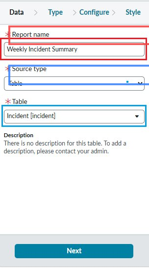

> **Red highlight:** The Report name field set to "Weekly Incident Summary". This is the name that appears in the Reports list, on dashboards, and on exported PDFs. It must be specific enough for any analyst to understand the scope without opening the report.
>
> **Blue highlight:** The Table field set to "Incident [incident]". This is the most consequential decision in the report. The Incident table is the correct table for volume, priority, state, and caller data. The wrong table here means none of the required fields will be available in the Configure step.
>
> The four-step wizard header (Data, Type, Configure, Style) is visible at the top. This screenshot captures the Data step. Clicking Next advances to Type.

---

### Phase 2 - Select List as the Report Type

**Step 2.1 - Search for List in the Type Step and Select It**

At the **Type** step, type "list" in the search box. One result appears. Select the List card and click Next.

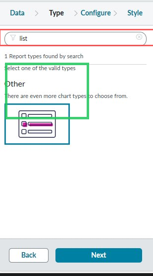

> **Green highlight:** The List report type card, selected with a teal outline. The List type renders one row per incident - the correct format for verifying that the table, columns, and filter are all producing the right data before converting to a chart.
>
> **Red highlight:** The search result count "1 Report types found by search". The List type is categorised under Other - ServiceNow separates it from the visual chart types. The card icon shows horizontal rows representing the list format.
>
> Always build as a list first, verify the records, then switch to a chart. A chart built on incorrect data looks authoritative and misleads everyone in the meeting.

---

### Phase 3 - Configure Columns

**Step 3.1 - Open the Columns Picker and Select the Required Fields**

At the **Configure** step, click **Choose columns**. Move required fields from Available (left) to Selected (right).

Columns selected:
Number, Opened, Short description, Caller, Priority, State, Category, Assignment group, Assigned to, Updated, Updated by

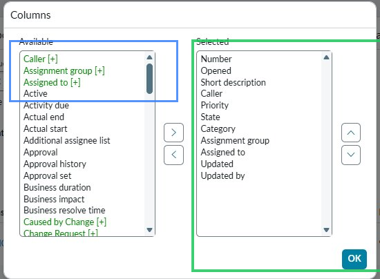

> **Green highlight:** The Selected columns panel on the right showing all eleven chosen fields. These columns cover identity (Number), timing (Opened), description (Short description), ownership (Caller, Assigned to, Assignment group), classification (Priority, State, Category), and audit trail (Updated, Updated by).
>
> **Blue highlight:** The Available columns panel on the left. Fields shown in teal with [+] notation are linked fields that can be expanded to include sub-fields from related tables if needed. For this report the standard fields are sufficient.
>
> Click OK to confirm. The up/down arrows on the right of the Selected panel reorder columns in the rendered report.

---

### Phase 4 - Add the Date Filter

**Step 4.1 - Set the Filter: Opened - At or After - This Week**

In the Configure step, click **Add Filter Condition** and set the three-part condition.

- **Field:** Opened
- **Operator:** at or after
- **Value:** This week

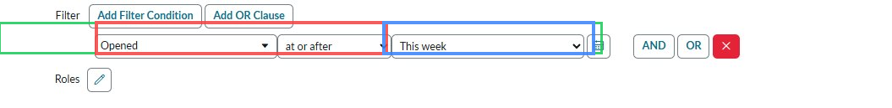

> **Green highlight:** The complete filter row. All three parts together define a dynamic date boundary: return only incidents opened at or after the start of the current calendar week.
>
> **Red highlight:** The operator "at or after". This includes incidents opened at exactly midnight Monday. Using "after" instead would exclude any incident opened at that precise boundary moment. For a weekly summary, "at or after" is always the correct operator.
>
> **Blue highlight:** The value "This week" - a dynamic relative date that recalculates automatically each time the report runs. The same saved report returns the correct week's incidents every time it is opened, with no manual date changes required.

---

### Phase 5 - Run the List Report and Review Results

**Step 5.1 - Click Run and Examine the Incident List**

Click **Run**. The report executes against the Incident table and renders all matching records.

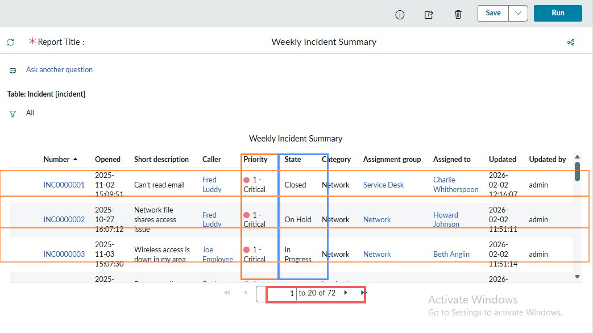

> **Red highlight (pagination):** "1 to 20 of 72" at the bottom. 72 total incidents is the headline weekly volume figure.
>
> **Orange highlight (Priority column):** All three visible rows show Priority 1 - Critical (red dot). The concentration at the top of the priority scale is immediately visible and signals a high-severity week.
>
> **Blue highlight (State column):** Closed, On Hold, and In Progress states are all visible. An On Hold Priority 1 (INC0000002) and an In Progress Priority 1 (INC0000003) are unresolved critical incidents that need immediate review at the service meeting.
>
> **Row highlights:** The first three incidents are all Priority 1 in the Network category, routed to the Network assignment group, reported by Fred Luddy and Joe Employee. This cluster suggests a possible related or recurring network issue that may warrant a Problem record.
>
> The list confirms the data is correct: 72 incidents, correct columns, priority and state fields populated. The report is ready to be converted to a bar chart.

---

### Phase 6 - Switch the Report Type to Bar Chart

**Step 6.1 - Return to Edit Report and Select the Bars Type**

Click **Edit report**. Navigate to the **Type** step and search for "bar". Select **Bars**.

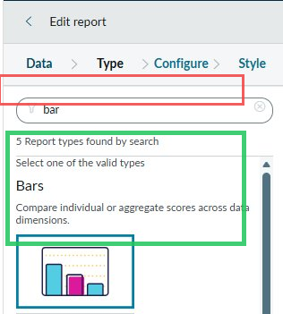

> **Green highlight:** The Bars chart type card selected with a teal outline. The description "Compare individual or aggregate scores across data dimensions" matches this use case exactly - comparing incident counts across priority levels.
>
> **Red highlight:** "5 Report types found by search" for "bar". The five types include standard Bars, Horizontal Bars, and Stacked Bars. Standard Bars is correct for a single-dimension priority comparison.
>
> After selecting Bars, set **Group by** to Priority in the Configure step. Group by determines the X-axis categories. Without it the chart renders as a single undifferentiated bar.

---

### Phase 7 - Run the Bar Chart Version

**Step 7.1 - Execute the Bar Chart and Confirm the Priority Distribution**

With Bars selected and Group by set to Priority, click **Run**.

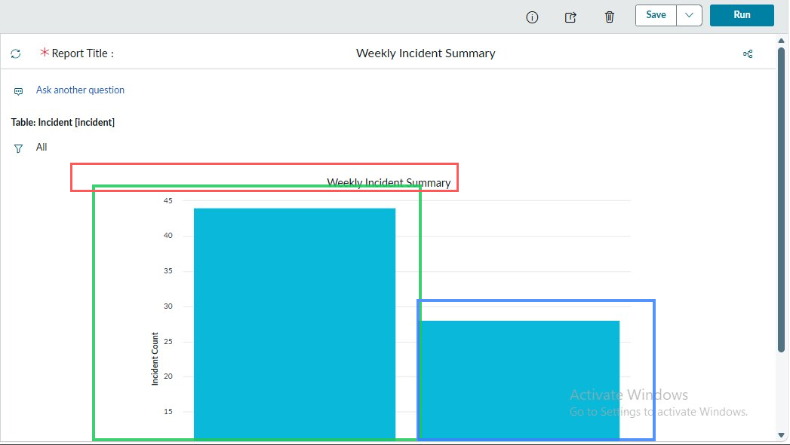

> **Red highlight:** The report title "Weekly Incident Summary" above the chart - to be renamed in the next step.
>
> **Green highlight:** The first bar reaching approximately 43 on the Y-axis. With 72 total incidents, this single bar represents approximately 60% of the week's volume, almost certainly Priority 1 - Critical based on the list report results.
>
> **Blue highlight:** The second bar at approximately 28 incidents - the second-highest priority group. The visible gap between the two bars communicates the priority imbalance instantly. At a service review, this chart requires no explanation.
>
> The Y-axis is labelled "Incident Count" and scales from 0 to 45. The chart is clean and presentation-ready.

---

### Phase 8 - Save and Rename the Report

**Step 8.1 - Save the Bar Chart as Weekly Incident Volume by Priority**

Click **Save** and rename to **Weekly Incident Volume by Priority**.

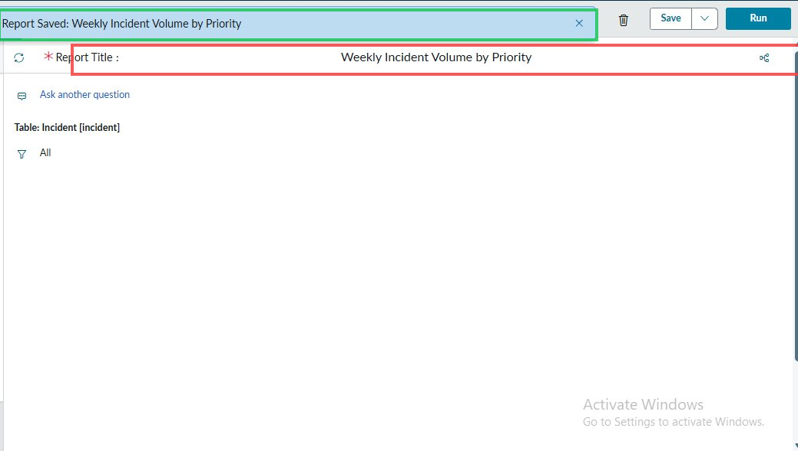

> **Green highlight:** The confirmation banner "Report Saved: Weekly Incident Volume by Priority". This is ServiceNow's confirmation that the save and rename completed successfully.
>
> **Red highlight:** The Report Title field now displaying "Weekly Incident Volume by Priority". The name is immediately reflected in the title field and across the instance Reports list.
>
> The rename is precise: the new name tells any analyst exactly what the chart shows - incident volume broken down by priority - making it immediately distinguishable from the SLA breach report created next.

---

### Phase 9 - Create the SLA Breached Incidents Report

**Step 9.1 - Reports > Create New - Set Table to Task SLA**

Navigate to **Reports > Create New** again. Complete the Data step for the second report.

- **Report name:** SLA Breached Incidents
- **Source type:** Table
- **Table:** Task SLA [task_sla]

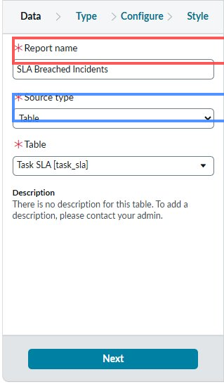

> **Red highlight:** The Report name "SLA Breached Incidents". The name signals this is a compliance report, not a volume report.
>
> **Blue highlight:** The Table field set to "Task SLA [task_sla]". This is a completely separate table from Incident [incident]. The Task SLA table stores one row per SLA agreement per task. A single incident can have multiple rows - one for the resolution SLA, one for the OLA, one for the Underpinning Contract. All breach separately and all appear in this report.
>
> This table distinction is the most common mistake in SLA reporting. The Has breached field does not exist on the Incident table - it is only available on the Task SLA table.

---

### Phase 10 - Add the SLA Breach Filter

**Step 10.1 - Set the Filter: Has Breached - Is - True**

In the Configure step, under **TASK SLA CONDITIONS**, add the breach filter.

- **Field:** Has breached
- **Operator:** is
- **Value:** true

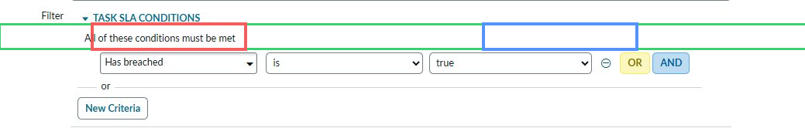

> **Green highlight:** The complete filter condition row. Has breached - is - true returns every Task SLA record where the SLA clock expired without the task being resolved.
>
> **Red highlight:** The "Has breached" field. This field only exists on the Task SLA table, confirming why the correct table selection in Step 9 matters. On the Incident table this field is absent.
>
> **Blue highlight:** The value "true". Has breached is a boolean field set automatically by the ServiceNow SLA engine when a deadline passes. There is no ambiguity: true means breached, false means not breached.
>
> The section header "TASK SLA CONDITIONS" confirms the filter is applied to the Task SLA table context.

---

### Phase 11 - Run the SLA Breach Report

**Step 11.1 - Execute and Review the Breach Results**

Click **Run**.

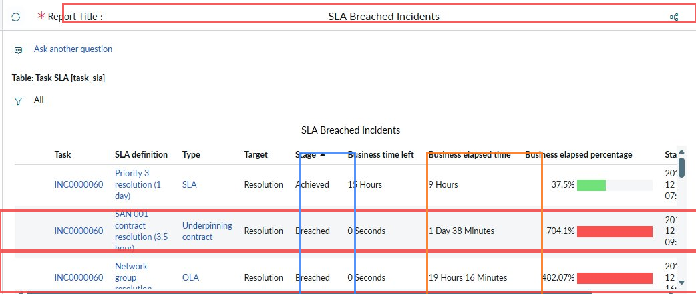

> **Red highlight (title):** "SLA Breached Incidents" against "Table: Task SLA [task_sla]" - correct report running against the correct table.
>
> **Red highlight (breached rows):** Two visually distinct breached records for INC0000060:
> - SAN 001 contract resolution (3.5 hour) - Underpinning contract - Breached - 1 Day 38 Minutes - **704.1%**
> - Network group resolution - OLA - Breached - 19 Hours 16 Minutes - **482.07%**
>
> Both show solid red progress bars in the Business elapsed percentage column.
>
> **Blue highlight (Stage column):** The first row for INC0000060 shows Achieved at 37.5% - the internal Priority 3 SLA was met. The two breached rows are contractual obligations (OLA and Underpinning Contract) - the external commitments were violated even though the internal SLA was kept.
>
> **Orange highlight (elapsed % column):** 704.1% and 482.07% are severe breaches meaning the resolution took 7x and 4.8x the contracted target respectively.

---

### Phase 12 - Open the Sharing Menu to Export

**Step 12.1 - Click the Sharing Icon and Review Distribution Options**

Click the sharing icon in the top right. The Sharing panel opens with four options.

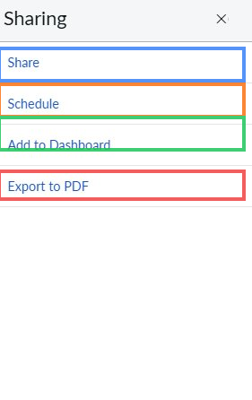

> **Red highlight:** **Export to PDF** - generates a portable, timestamped evidence document that can be shared outside ServiceNow. This is the option used to produce the audit-grade export for the service review.
>
> **Blue highlight:** **Share** - sends a link to the live report to other ServiceNow users. Recipients can run the report themselves.
>
> **Orange highlight:** **Schedule** - configures the report to run automatically and email results on a set schedule. The SLA breach report could be scheduled to run every Friday at 07:00 and email the team lead before the meeting starts.
>
> **Green highlight:** **Add to Dashboard** - places the report as a live widget on a ServiceNow homepage. The breach count and priority bar chart together on a dashboard give the team real-time visibility without navigating to Reports.

---

### Phase 13 - Review the Exported PDF

**Step 13.1 - Confirm the PDF Contains All Metadata and Data Rows**

The PDF renders with a standard header block followed by the full data table.


> **Blue highlight:** The metadata header block:
> - Report Title: SLA Breached Incidents
> - Run Date and Time: 2026-05-06 02:42:14 Pacific Daylight Time
> - Run by: System Administrator
> - Table name: task_sla
> - Group by: Active
> - Sort Order: Active in ascending order
>
> This block makes the export auditable. It proves when the data was pulled, who pulled it, and from which table. A PDF without this information cannot serve as compliance evidence.
>
> **Orange highlight:** The column header row - Task, SLA definition, SLA definition Type, SLA definition Target, Stage, Business time left, Business elapsed time, Business elapsed percentage, Start time, Stop time.
>
> **Red highlight:** INC0008111 (Priority 3 SLA, Completed, 661 Days 14 Hours 54 Minutes, **66,162.13%**) and INC0000060 (Priority 1 SLA, Cancelled, 7 Hours 3 Minutes, 705.17%). INC0008111 at 66,162% is a data quality flag - a Priority 3 incident with a 1-day SLA that remained open in ServiceNow for 661 days. This record needs to be investigated and closed with appropriate notes.
>
> **Green highlight:** "Page 1" confirming the 24 Task SLA records span multiple pages.

---

## The Two Reports at a Glance

| Report | Source table | Filter | Type | Purpose |
|---|---|---|---|---|
| **Weekly Incident Volume by Priority** | Incident [incident] | Opened - at or after - This week | Bar chart grouped by Priority | Visualise this week's incident volume by priority for the service review presentation |
| **SLA Breached Incidents** | Task SLA [task_sla] | Has breached - is - true | List exported to PDF | Identify every SLA record where the deadline was missed, for compliance and escalation review |

---

## Before and After Comparison

### Before - No Reports, No Evidence

| What the team had | What was missing |
|---|---|
| 72 incidents in ServiceNow | No aggregated view of weekly volume |
| Multiple Priority 1 incidents open or on hold | No visual of priority distribution |
| SLA breach records in task_sla | No filtered breach list for the review |
| A service review meeting to attend | No data to present, no PDF to share |

### After - Two Reports Built, Exported, and Ready

| Output | Format | Used for |
|---|---|---|
| Weekly Incident Volume by Priority | Bar chart in ServiceNow | Screen share in the service review meeting |
| SLA Breached Incidents | List exported to PDF | Evidence document for the review pack |
| PDF with metadata block | Dated 2026-05-06 02:42:14 | Audit trail confirming when data was pulled |
| Analyst summary | Written in README | Verbal briefing notes for whoever presents |

---

## Help Desk Ticket Notes

See `TICKET_NOTES.md` in this folder for field-by-field notes on both report configurations, column selection rationale, SLA table structure, notable breach record analysis, and observations on ServiceNow reporting behaviour.

---

## Outcome and Validation

| Check | Result |
|---|---|
| Reports > Create New navigation found | Pass |
| Report name set to Weekly Incident Summary | Pass |
| Source type Table and Table set to Incident [incident] | Pass |
| List report type selected at the Type step | Pass |
| Eleven columns configured in the Selected panel | Pass |
| Filter added: Opened - at or after - This week | Pass |
| Report run as list - 72 total incidents returned | Pass |
| Priority 1 - Critical dominant in the list results | Pass |
| Report type changed to Bars | Pass |
| Bar chart rendered with priority grouping | Pass |
| Report saved and renamed to Weekly Incident Volume by Priority | Pass |
| Save confirmation banner visible | Pass |
| Second report created: SLA Breached Incidents | Pass |
| Table set to Task SLA [task_sla] | Pass |
| Filter: Has breached - is - true applied under TASK SLA CONDITIONS | Pass |
| SLA breach report run - 704% and 482% breach records visible | Pass |
| Sharing menu opened | Pass |
| Export to PDF selected and PDF generated | Pass |
| PDF contains metadata block with run date, run by, table name | Pass |
| 5-sentence analyst summary written covering all required topics | Pass |

---

## What I Learned

1. **The table selection drives everything.** Incident [incident] and Task SLA [task_sla] are separate tables. SLA breach data does not exist on the Incident table. Choosing the wrong table means the required filter fields are absent and the report cannot be built.

2. **Build as a list first, then switch to a chart.** The list run confirmed 72 incidents were returning correctly with populated priority and state columns before converting to a bar chart. A chart built on an incorrectly filtered query will mislead every person who sees it.

3. **Dynamic date filters make reports reusable.** "This week" recalculates automatically. A hardcoded date range requires manual updating every week. Any report intended for regular use should use dynamic values.

4. **One incident can produce multiple SLA breach records.** INC0000060 appeared three times in the SLA breach report. The incident count and the SLA breach count measure different things. Volume reporting and SLA compliance reporting require two separate queries against two separate tables.

5. **The PDF metadata block is the audit trail.** Run Date and Time, Run by, and Table name together constitute the chain of custody for exported data. Always export from ServiceNow rather than copying to a spreadsheet when compliance evidence is needed.

6. **Report naming is data governance.** In a shared instance with multiple analysts, clear and consistent naming prevents duplicate reports, reduces confusion, and makes scheduled exports manageable.

7. **The Sharing menu completes the reporting workflow.** Export produces evidence. Schedule automates delivery. Add to Dashboard makes KPIs permanently visible. Share gives colleagues direct access. These four options are the distribution layer that makes reports useful to people who are not running them.

---

## Real World Relevance

Weekly SLA review reporting is standard practice in any organisation operating under ITIL or a managed service contract. The service review is the forum where the service provider demonstrates performance against agreed targets, explains any breaches, and proposes corrective actions.

The two reports built here are the minimum data set for that meeting. In a real service desk environment the reporting pack would also include: average resolution time by priority, first-call resolution rate, volume trend over 4 to 8 weeks, top 10 categories, and change-related incident spikes. All are built using the same four-step approach demonstrated in this lab.

An analyst who can extract data from ServiceNow, interpret it correctly, and communicate it in business language is providing a fundamentally different level of value than one who can only run reports without understanding what they mean. This lab is that starting point.

---

## Troubleshooting Reference

| Situation | Correct Action | Common Mistake |
|---|---|---|
| Report returns zero results with This week filter | Remove the date filter and run to confirm the table has data. PDI demo data may not contain incidents dated this week - change to Last 30 days or Last year to verify | Concluding the report tool is broken rather than checking whether any data matches the filter |
| Bar chart shows one bar instead of multiple | Check that Group by is set to Priority in the Configure step. None or a single-value field produces one bar | Running the bar chart with no Group by and getting a single undifferentiated bar |
| Has breached field not in the filter dropdown | Confirm the Table is set to Task SLA [task_sla]. The Has breached field does not exist on the Incident table | Building the SLA breach report on the Incident table and not finding Has breached in the filter builder |
| Export to PDF is greyed out | Save the report first, then open the Sharing menu. Unsaved reports cannot be exported | Opening Sharing on an unsaved report and finding Export to PDF unavailable |
| PDF shows metadata header but no data rows | The report returned zero records at export time. Run in the browser first to confirm results exist before exporting | Exporting a zero-result report and sending an empty PDF to the team lead |
| Column order in the report is wrong | Use the up/down arrows on the right of the Selected panel in the Columns picker to reorder. The Available panel arrows have no effect on order | Trying to reorder columns in the Available panel |
| Scheduled report not sending emails | Confirm recipient email addresses are valid ServiceNow users or correct external addresses, timezone matches intended delivery time, and the Schedule form was saved after configuration | Configuring a schedule but navigating away without saving, leaving the schedule in an unsaved state |
